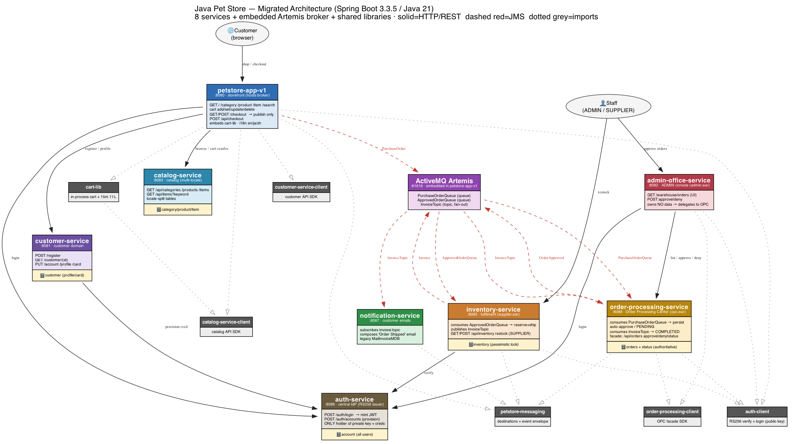

# Java Pet Store — Migrated to Spring Boot 3.3.5 / Java 21

**Project URL:** https://github.com/Vishak-94/pet-store

A migration of the legacy **Java Pet Store 1.3.1_02** (J2EE 1.3 BluePrints — EJB 2.x CMP,
JMS, Cloudscape, 4 `.ear` apps) to a modern **Spring Boot 3.3.5 / Java 21** system: **8 runnable
services + 1 standalone ActiveMQ Artemis broker + 2 shared libraries + 5 published client SDKs**.



*(Full-resolution: [`docs/petstore_architecture.svg`](docs/petstore_architecture.svg) · package/SDK
dependencies: [`docs/petstore_packages.png`](docs/petstore_packages.png) · regenerate with
`python3 docs/petstore_architecture.py`. Solid = HTTP/REST, dashed red = JMS, dotted grey = library/SDK imports.)*

The migration was approached **as if the legacy codebase were far larger**: work was broken into
phased tasks, behaviour was pinned with **characterization tests** before any change, and the system
was decomposed along its legacy bounded contexts using the **strangler-fig** and **ports-and-adapters**
patterns. Every significant decision (options considered + why) is logged in
[`DECISIONS.md`](DECISIONS.md) (~30 ADRs).

> **Scope note.** The core assignment is a *runtime migration* to Spring Boot / Java 21. This repo goes
> further and demonstrates how the same legacy app would be **decomposed at scale** into services along
> its natural seams (catalog / cart / customer / order-processing / inventory / auth / notifications)
> coordinated over JMS, each with its own database and an importable client SDK.

---

## Prerequisites

| Tool | Version |
|------|---------|
| JDK  | **Java 21** (tested with Amazon Corretto 21) |
| Maven | 3.9+ |
| Docker | for the standalone Artemis **broker** (and, optionally, the MongoDB stretch track) |
| OS | macOS / Linux (scripts are bash; `lsof`, `nc`, `curl` used) |

Each stateful service owns a **file-based H2** database (survives restarts — no DB to install). The
**ActiveMQ Artemis** broker runs as a standalone container on `:61616` (started first by `run-all.sh`).
MongoDB is only needed for the optional stretch track (below).

---

## Build & Run (one command each)

```bash
./generate-keys.sh   # one-time: create the RSA keypair auth-service signs tokens with
./build-all.sh       # builds + installs all modules in dependency order (libs → SDKs → apps)
./run-all.sh         # starts the broker container first, then every service; waits for health
# ... use the app ...
./stop-all.sh        # stops everything
./logs-all.sh        # tail every service log at once
```

`run-all.sh` auto-detects a Java 21 JDK (via `JAVA_HOME` or `/usr/libexec/java_home -v 21`) and brings
up the broker via `docker compose up -d broker`. Per-service logs are written to `./logs/`.

> **Note:** `order-processing-service` is built on its own (not part of `build-all.sh`) — see its
> [README](order-processing-service/README.md). `run-all.sh` still launches it.

Then open the storefront: **http://localhost:8080/**

### Run the tests

```bash
# per module (each is a standalone Maven build):
cd <module> && mvn test
```

**~172 test methods across the fleet, all green.** These are predominantly **characterization tests**
pinning legacy observable behaviour (cart quirks, catalog not-found semantics, order/fulfilment rules,
sales aggregation) plus the hardening tests (optimistic-lock 409, lifecycle-transition guard, outbox
relay, pessimistic oversell guard, DLQ). The order-processing MongoDB integration tests
(Testcontainers) **skip automatically** when no Docker is reachable, so a plain `mvn test` stays green.

---

## Services & ports

| Port | Service | Responsibility | Legacy origin |
|------|---------|----------------|---------------|
| 8080 | **[petstore-app-v1](petstore-app-v1/README.md)** | Storefront: catalog browse, cart, checkout. Embeds `cart-lib`; synchronous REST checkout intake → OPC. | petstore.ear |
| 8081 | **[customer-service](customer-service/README.md)** | Customer domain data (profile / account / card). | customer component |
| 8082 | **[admin-office-service](admin-office-service/README.md)** | Back-office ADMIN console (approve/deny/status/sales). Delegates to OPC; owns no order data. | admin.ear + opc.ear facade |
| 8083 | **[catalog-service](catalog-service/README.md)** | Catalog (categories/products/items), multi-locale. **H2 or MongoDB.** | catalog component |
| 8085 | **[inventory-service](inventory-service/README.md)** | Inventory + fulfilment (SUPPLIER). Pessimistic oversell guard. | supplier.ear |
| 8086 | **[auth-service](auth-service/README.md)** | Central identity provider — the sole RS256 token issuer + credential store. | signon component |
| 8087 | **[notification-service](notification-service/README.md)** | Emails the customer on order events; observes the DLQ. | opc mailer MDBs |
| 8088 | **[order-processing-service](order-processing-service/README.md)** | **Authoritative** order store + workflow (OPC). **H2 or MongoDB.** | opc.ear |
| 61616 | *Artemis broker* | Shared JMS (standalone container). | JMS backbone |

**Shared libraries** (imported jars, not runnable): **[petstore-messaging](petstore-messaging/README.md)**
(JMS destinations + event envelope + converter + publisher) and **[cart-lib](cart-lib/README.md)**
(in-process cart). **Client SDKs** (published per service, imported by callers): `auth-client`,
`catalog-service-client`, `customer-service-client`, `order-processing-client`, `inventory-service-client`
— each documented in its service's `client/README.md`.

---

## Architecture

```
Browser ─▶ petstore-app-v1 (:8080 storefront)
             │  ├─ login ───────▶ auth-service (:8086)   issues RS256 JWT; every service verifies with the public key
             │  ├─ browse ──────▶ catalog-service (:8083)
             │  ├─ profile ─────▶ customer-service (:8081)
             │  ├─ stock badge ─▶ inventory-service (:8085)
             │  └─ checkout ──── synchronous REST intake ─▶ order-processing-service (:8088)
             ▼
     Artemis broker (:61616, standalone container)
       ApprovedOrderQueue ─▶ inventory-service      reserve stock + ship (all-or-nothing)
       InvoiceTopic (pub/sub) ─┬▶ order-processing   → order COMPLETED
                               └▶ notification-service → email customer
       OrderStatusTopic ──────▶ notification-service  → status email
       RestockTopic ──────────▶ order-processing      → re-drive backordered orders
       DLQ / ExpiryQueue ─────▶ notification-service  → ERROR log (quarantine observer)
```

- **Auth.** `auth-service` is the only credential store and the only token minter (RS256 — private key
  held only by auth-service; every other service verifies with the public key via `auth-client`, so they
  **cannot** forge tokens).
- **Messaging.** Two queues (point-to-point commands) + three topics (event fan-out) + a DLQ, all defined
  once in `petstore-messaging`. Outbound events from OPC use a **transactional outbox** (atomic commit +
  eventual publish); consumers are **idempotent** (at-least-once safe); poison messages route to the **DLQ**
  after 3 attempts with exponential back-off.
- **Data.** Database-per-service (file H2). Cross-service references are by opaque id, never shared tables.

Full high-level map: [`docs/ARCHITECTURE.md`](docs/ARCHITECTURE.md).

---

## MongoDB (optional stretch goal) — **implemented**

The stretch goal is delivered for the two aggregate-shaped stores where it is most interesting —
**order-processing-service** and **catalog-service** — behind the same repository **ports**, so the swap
is *additive* (no change to domain, services, or tests):

- Both services keep their JPA/H2 adapter as the default (`@Profile("!mongo")`) and add a MongoDB adapter
  (`@Profile("mongo")`) behind the same `OrderStore` / `CatalogRepository` port.
- MongoDB 7.0 runs as a **single-node replica set `rs0`** (required for multi-document transactions — the
  OPC order-write + outbox-enqueue commit atomically) via the repo `docker-compose.yml`.
- **`$jsonSchema` validators + indexes** are applied on startup; the `@Version` optimistic lock is preserved
  on Mongo (single-document atomicity alone does **not** prevent the read-modify-write lost update).
- Integration tests run against **Testcontainers `mongo:7.0`** and **skip gracefully** without Docker.

```bash
docker compose up -d mongo                                   # rs0 on :27018 (mongo-express on :8971)
SPRING_PROFILES_ACTIVE=mongo mvn -pl app spring-boot:run     # from order-processing-service/ or catalog-service/
```

Details: [`docs/MONGODB_SCHEMA.md`](docs/MONGODB_SCHEMA.md), [`docs/CATALOG_MONGODB_SCHEMA.md`](docs/CATALOG_MONGODB_SCHEMA.md).

---

## Migration approach (summary)

1. **Analyse & pin.** Reverse-engineered the legacy apps; wrote **characterization tests** capturing
   observable behaviour (cart "add resets qty to 1", catalog miss → empty not error, subtotal skips
   dangling items, order/fulfilment rules) *before* touching anything.
2. **Strangler-fig, phase by phase.** Migrated one bounded context at a time (catalog → cart → order →
   customer → …), keeping the system runnable throughout ([`docs/MIGRATION_PLAN.md`](docs/MIGRATION_PLAN.md),
   [`docs/PHASE7_CUTOVER.md`](docs/PHASE7_CUTOVER.md)).
3. **Ports & adapters.** Domain logic depends on ports (`CatalogRepository`, `OrderStore`, `InventoryStore`);
   JPA / Mongo / JMS are swappable adapters. This is the seam that made the MongoDB swap a 2-file change.
4. **Preserve JMS.** Kept async messaging (Artemis) with a shared `petstore-messaging` library so the wire
   contract is single-sourced; XML-over-JMS became JSON DTOs behind an anti-corruption layer.
5. **Decompose at the seams.** Extracted services along the legacy `.ear` boundaries + a central auth IdP,
   each with its own DB and an importable client SDK.
6. **Parity first, then harden.** A file-by-file [`docs/PARITY_AUDIT.md`](docs/PARITY_AUDIT.md) tracked
   legacy-vs-migrated gaps (21 found, all resolved or explicitly kept). Net improvements beyond parity
   (BCrypt, transactional outbox, optimistic + pessimistic locks, DLQ, idempotency, CSRF, correlation ids)
   are recorded as ADRs in [`DECISIONS.md`](DECISIONS.md).

---

## Notes / known limitations

- **Auth keys:** the RSA **private** key is generated locally by `./generate-keys.sh` and is *git-ignored*
  (never committed); only the **public** key is committed (it's meant to be shared — that's how verifier
  services validate tokens without being able to forge them). A real deployment would inject the private key
  as a secret and serve the public key via JWKS for rotation.
- **Checkout idempotency** is implemented (encrypted pre-checkout order key via `OrderKeyCipher` +
  OPC-side dedup), so a refresh / double-submit maps to the same order.
- **MongoDB** covers OPC + catalog (the aggregate-shaped stores); the remaining services stay on H2 — a
  deliberate, ports-preserving scope.
- Credit-card PAN encryption and broker authentication are documented demo deferrals (see `DECISIONS.md`).
