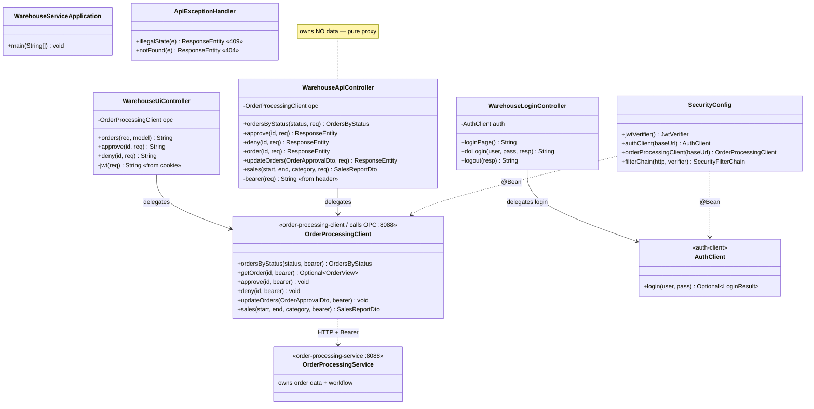
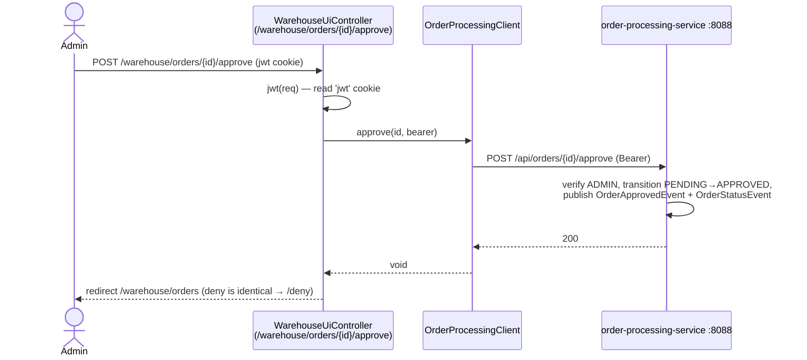
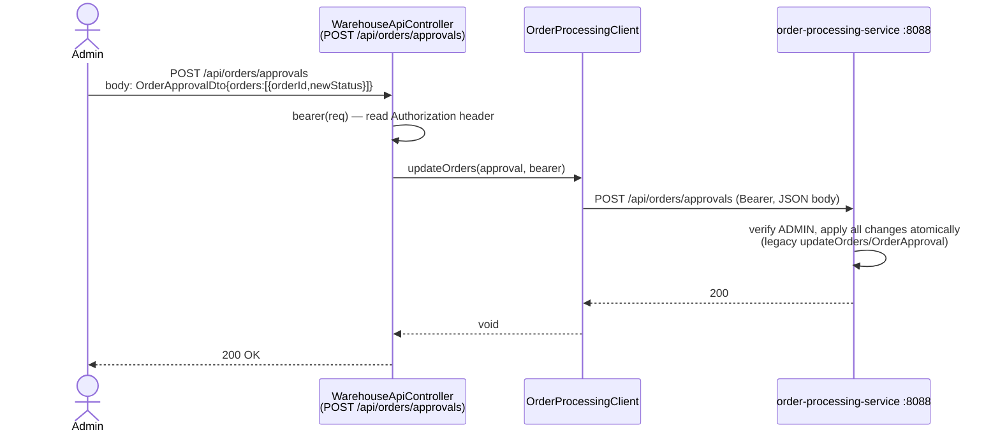
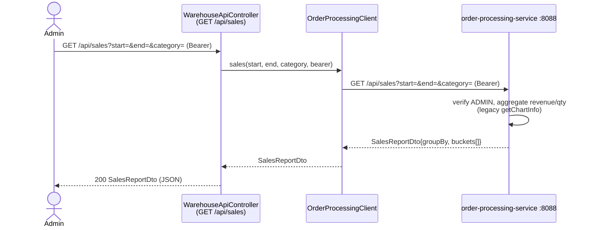

# admin-office-service — Low-Level Design

Back-office **ADMIN console** on **port 8082** (legacy `admin.ear`), package root
`com.petstore.warehouse`. See the repo skill
[`../../.claude/skills/petstore-dev/SKILL.md`](../../.claude/skills/petstore-dev/SKILL.md) for the module
map, auth model, and build/run; the module guide is [`../CLAUDE.md`](../CLAUDE.md).

## Class & schema diagrams

Generated by [`admin-office-service_lld.py`](admin-office-service_lld.py) on the shared house
style ([`../../docs/lld_style.py`](../../docs/lld_style.py)); every class, method, DTO and field is
extracted from real source.

- **Class diagram** — [`admin-office-service_class.png`](admin-office-service_class.png) ·
  [`.svg`](admin-office-service_class.svg): the thin Web layer + Config/Security wiring, and the two
  **reused client SDKs** (`order-processing-client`, `auth-client`) it delegates every operation to.
  Makes the "owns no data" seam and the SDK reuse visually obvious.
- **Data-aggregation / wire-contract diagram** — [`admin-office-service_schema.png`](admin-office-service_schema.png) ·
  [`.svg`](admin-office-service_schema.svg): this module has **no database**, so instead of an ER
  schema it shows the DTOs consumed via the SDKs (owned by OPC / auth-service) and the in-memory
  Thymeleaf view-model rows `WarehouseUiController` projects from them.

## Overview — the delegation pattern

This service is a **thin presentation + proxy layer**. It owns **no order data** and runs **no
persistence or messaging** (its `pom.xml` deliberately has no JPA/H2/JMS). Every order operation —
listing, detail, approve, deny, atomic batch approval, and sales reporting — is **delegated to
order-processing-service (the OPC)** over HTTP through the imported `OrderProcessingClient`
(`order-processing-client`), exactly as the legacy `admin.ear` called `OPCAdminFacade`.

Two front doors sit on the same delegate:

- **`WarehouseUiController`** — a server-rendered Thymeleaf approval console (`/warehouse/**`); reads the
  JWT from the `jwt` cookie.
- **`WarehouseApiController`** — a JSON API (`/api/**`); reads the JWT from the `Authorization` header.

Both forward the acting admin's Bearer token to the OPC, which re-enforces ADMIN and does the real work.
`SecurityConfig` provides the `OrderProcessingClient` and `AuthClient` beans and gates every route to
`ROLE_ADMIN` (login/actuator excepted). Login itself is delegated to `auth-service` via `AuthClient`.

## Class diagram

## Sequence — admin approve / deny (console)

## Sequence — batch approval (JSON API)

## Sequence — sales report (JSON API)

## Endpoint table

| Method | Path | Kind | ADMIN | Delegates to (OPC via `OrderProcessingClient`) |
|--------|------|------|:-----:|-----------------------------------------------|
| GET  | `/warehouse/orders` | UI | yes | `ordersByStatus("PENDING")` + `getOrder(id)` per row |
| POST | `/warehouse/orders/{id}/approve` | UI | yes | `approve(id)` |
| POST | `/warehouse/orders/{id}/deny` | UI | yes | `deny(id)` |
| GET  | `/warehouse/login` | UI | no (permitAll) | — (renders form) |
| POST | `/warehouse/login` | UI | no (permitAll) | `AuthClient.login` (→ auth-service) |
| POST | `/warehouse/logout` | UI | no (permitAll) | — (clears `jwt` cookie) |
| GET  | `/` | UI | authenticated | redirect → `/warehouse/orders` |
| GET  | `/api/orders?status=` | API | yes | `ordersByStatus(status)` |
| GET  | `/api/orders/{id}` | API | yes | `getOrder(id)` → 404 if empty |
| POST | `/api/orders/{id}/approve` | API | yes | `approve(id)` |
| POST | `/api/orders/{id}/deny` | API | yes | `deny(id)` |
| POST | `/api/orders/approvals` | API | yes | `updateOrders(OrderApprovalDto)` — atomic batch |
| GET  | `/api/sales?start=&end=&category=` | API | yes | `sales(start, end, category)` |
| GET  | `/actuator/**` | ops | no (permitAll) | — |

## Design decisions / invariants

1. **Delegate, never store.** No JPA/H2/JMS dependency; the OPC is the single authoritative order store.
   Add admin features by extending `OrderProcessingClient` + a controller method + a role rule — never a
   local persistence layer. (Repo ADRs: [`../../DECISIONS.md`](../../DECISIONS.md).)
2. **Thin controllers.** Read token → call client → map. No business logic (thresholds, transitions,
   aggregation) is duplicated here.
3. **ADMIN role, defence in depth.** `SecurityConfig` gates every order/sales/users route to `ROLE_ADMIN`
   and forwards the Bearer token; the OPC re-checks ADMIN.
4. **Verify-only auth.** Bundled RS256 **public** key (`auth-client`); login delegated to `auth-service`.
   Cannot mint tokens; holds no credentials.
5. **Two token sources.** UI = `jwt` cookie; API = `Authorization` header. Stateless session, CSRF disabled.
6. **Error mapping.** `ApiExceptionHandler` maps `IllegalStateException`→409, `IllegalArgumentException`→404;
   `SecurityConfig` returns JSON 401/403 for `/api/**`, redirects to login for UI routes.
7. **Legacy-faithful names.** Package `com.petstore.warehouse` and `/warehouse/**` routes come from the
   legacy `admin.ear`; keep them. Parity baseline: [`../../docs/PARITY_AUDIT.md`](../../docs/PARITY_AUDIT.md).

## Reusability & extensibility

This console is deliberately the *smallest* runnable service in the fleet — it owns no domain code, no
persistence, and no messaging. Nearly all of its behaviour is **reused** from shared libraries; what it
adds is thin plumbing (read token → call SDK → map result). That makes both what it reuses and how it is
safely extended very concrete:

**What is reused (imported, not re-implemented):**

- **`order-processing-client` SDK** — `OrderProcessingClient` is the single delegate for *every* order
  operation (`ordersByStatus`, `allOrders`, `getOrder`, `approve`, `deny`, `updateOrders`, `sales`). Both
  `WarehouseUiController` and `WarehouseApiController` hold the same injected `opc` instance. The wire
  contract itself is reused: `WarehouseApiController` maps its routes with the SDK's
  `OrderProcessingEndpoints` constants (`ORDERS`, `ORDER_APPROVE`, `PARAM_STATUS`, …) and its parameter
  types are the SDK's `OrderDtos` records (`OrderApprovalDto`, `SalesReportDto`, `OrdersByStatus`), so this
  proxy **cannot drift** from the OPC facade it fronts.
- **`auth-client` SDK** — verify-only security is entirely borrowed: `SecurityConfig` builds a `JwtVerifier`
  from `AuthPublicKey.bundled()` (public key only) and registers `AuthJwtFilter` in the filter chain; login
  is delegated to `AuthClient.login`. No JWT parsing, key handling, or credential code lives in this module.
- **`ResilientRestClient`** wraps the SDK-supplied `RestClient` in a Resilience4j circuit breaker + GET-only
  retry and is reused for *both* downstreams (`SecurityConfig.authClient` and `orderProcessingClient`) via
  one `forService(name, baseUrl)` factory call each.
- **The shared LLD diagram library** (`docs/lld_style.py`) renders these diagrams in the same house style as
  every other module — reuse the LLDs themselves describe.

**How it is extended safely:**

- **New admin capability → new SDK method + controller method + role rule.** Add the method to
  `OrderProcessingClient` (and an `OrderProcessingEndpoints` constant), then a one-line delegating method on
  `WarehouseApiController` / `WarehouseUiController`, and, if a new path prefix is introduced, an entry in
  `SecurityConfig.ADMIN_MATCHERS`. Never add a local order store — invariant #1.
- **Additive DTO evolution.** Because DTOs are records consumed via the SDK, a new *trailing* field on
  `OrderView`/`OrderSummaryDto` (e.g. `currency` today) deserializes on the old client without change; the
  view-model maps (`pending[]`, `orders[]`) simply ignore fields they don't project.
- **New downstream / new resilience policy** is a new `ResilientRestClient.forService(name, baseUrl)` bean in
  `SecurityConfig` — the breaker/retry config is centralized, so tuning is one edit.
- **Config-gated behaviour** rather than code forks: `services.opc.base-url` / `services.auth.base-url` retarget
  the downstreams per environment, and `cookie.secure` flips the `jwt-warehouse` cookie to HTTPS-only for a
  real deployment without touching the login flow.
- **Error mapping is open for extension** in `ApiExceptionHandler`: a new downstream fault maps to a new
  `@ExceptionHandler` (the existing ones turn OPC 5xx → 502 and transport failure → 503) without changing any
  controller.
