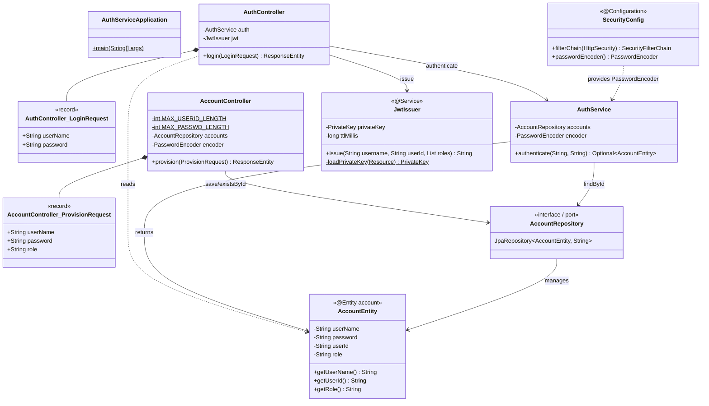
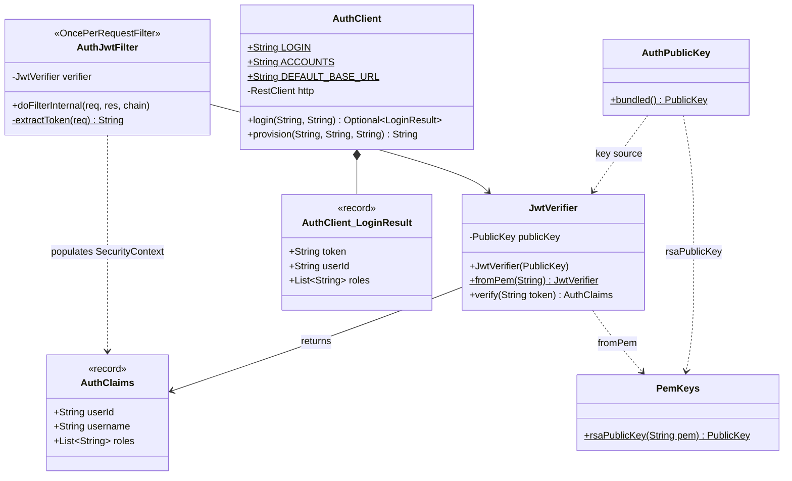
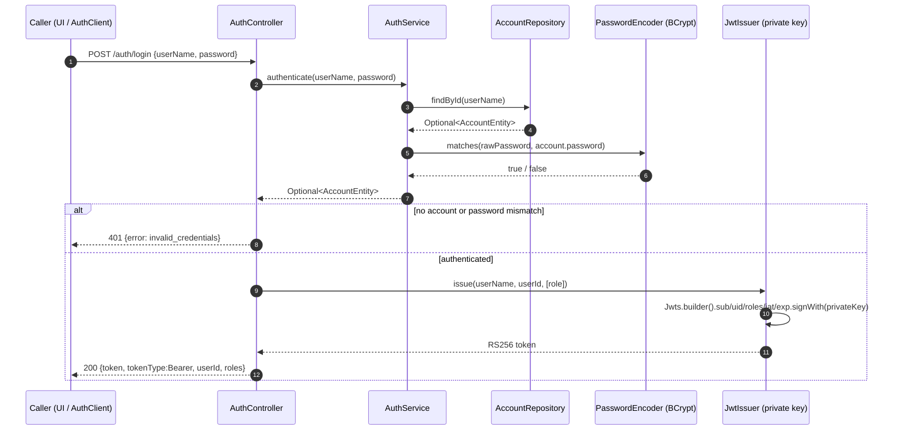
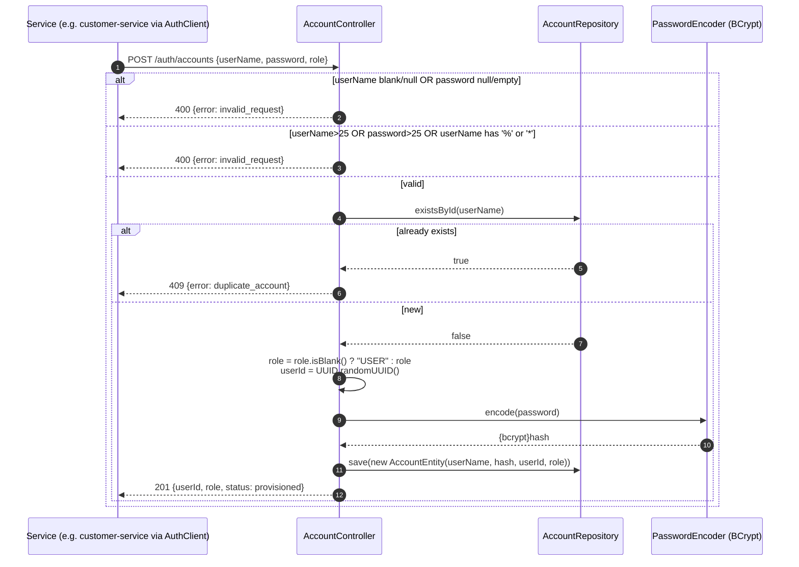
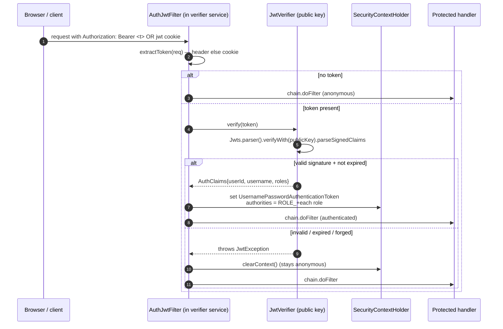

# auth-service — Low-Level Design

Central Identity Provider (IdP) for the migrated Pet Store, port **8086**. It is the single
RS256 token **issuer** and the single **credential store**; every other service is a pure
verifier holding only the public key (bundled in `auth-client`). Shared platform conventions
live in the repo skill `../../.claude/skills/petstore-dev/SKILL.md`; architecture rationale in
`../../DECISIONS.md`; the legacy behavioural baseline in `../../docs/PARITY_AUDIT.md`.

The reactor has two artifacts:

- **`auth-service` (app)** — the runnable IdP. Holds the RSA private key, checks passwords,
  mints tokens, owns the `account` table.
- **`auth-client` (client)** — importable verify SDK. Holds only the public key. Provides a
  token verifier, a ready-to-wire Spring filter, shared claim types, and a thin login/provision
  HTTP client.

## Class design — app (`com.petstore.authsvc`)

`JwtIssuer` is the **only** holder of the private key (loaded from `auth-private-key.pem`,
PKCS#8) and the only `signWith` call. `AccountRepository` is the persistence port; the JPA
adapter is provided by Spring Data over `AccountEntity`.

## Class design — client (`com.petstore.auth.client`)

Only the **public** key ever reaches this module (`petstore-auth-public.pem`, loaded by
`AuthPublicKey.bundled()`). There is no signing path, so importers can verify but not forge.

## Sequence — login → issue RS256 token

## Sequence — provision (with validation)

## Sequence — downstream service verifying a token via AuthJwtFilter

## Endpoints

| Method | Path             | Auth | Request | Success | Errors |
|--------|------------------|------|---------|---------|--------|
| POST   | `/auth/login`    | public | `{userName, password}` | 200 `{token, tokenType:Bearer, userId, roles}` | 401 `invalid_credentials` |
| POST   | `/auth/accounts` | public | `{userName, password, role}` | 201 `{userId, role, status:provisioned}` | 400 `invalid_request`, 409 `duplicate_account` |
| GET    | `/actuator/**`   | public | — | health/info/metrics | — |

All other paths are `denyAll()` (`SecurityConfig`). Service is stateless (no sessions), CSRF
disabled.

## Token claims

| Claim  | Source | Meaning |
|--------|--------|---------|
| `sub`  | `AccountEntity.userName` | login name |
| `uid`  | `AccountEntity.userId`   | stable opaque id other services reference |
| `roles`| `[AccountEntity.role]`   | drives `ROLE_*` authorities on verifiers |
| `iat`/`exp` | now / now + `auth.jwt.ttl-seconds` (default 3600) | validity window |

Adding a claim/role is a **coordinated three-file change**: `JwtIssuer.issue` (write),
`JwtVerifier.verify` (read), and the `AuthClaims` record (carry). Keep them in lockstep or
verifiers silently drop the new data.

## Key management

`generate-keys.sh` (repo root) creates an RSA-2048 keypair: the PKCS#8 private key is copied to
`app/resources/auth-private-key.pem` (gitignored) and the public key to
`client/resources/petstore-auth-public.pem` (committed and safe to share). `JwtIssuer` reads
the private key via `auth.jwt.private-key` (`application.yml`); verifiers load the bundled
public key with `AuthPublicKey.bundled()`. Rotating keys = rerun the script and rebuild both
modules so verifiers pick up the new public key.

## Design decisions / invariants

- **Asymmetric (RS256), not symmetric.** Verifiers must never be able to mint tokens; only the
  IdP holds the signing key. `auth-client` has no signing code path at all.
- **One account store for all realms.** `USER` (customer), `SUPPLIER`, `ADMIN` share the
  `account` table; only authentication data lives here (profile/cards are in customer-service).
- **Legacy `UserEJB` validation preserved.** 25-char caps on userName/password and the ban on
  `%`/`*` in userName mirror the legacy EJB and are pinned by `AccountControllerTest`.
- **BCrypt via delegating encoder** (`{bcrypt}` prefix) — the only password check in the fleet.
- **Provision is the only write path** into the store besides `data.sql` seeds
  (`j2ee/j2ee` USER, `supplier/supplier` SUPPLIER, `admin/admin` ADMIN).
