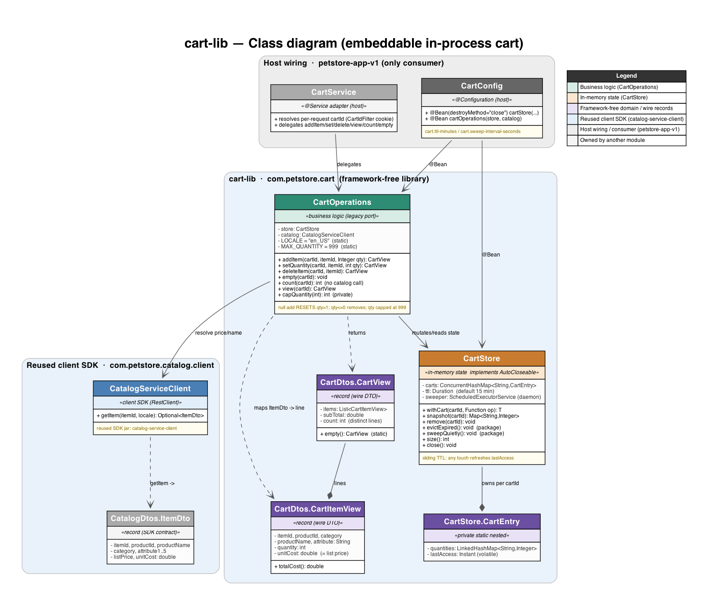
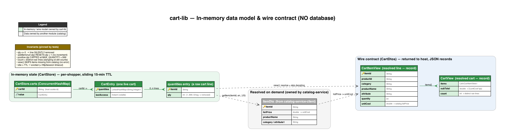
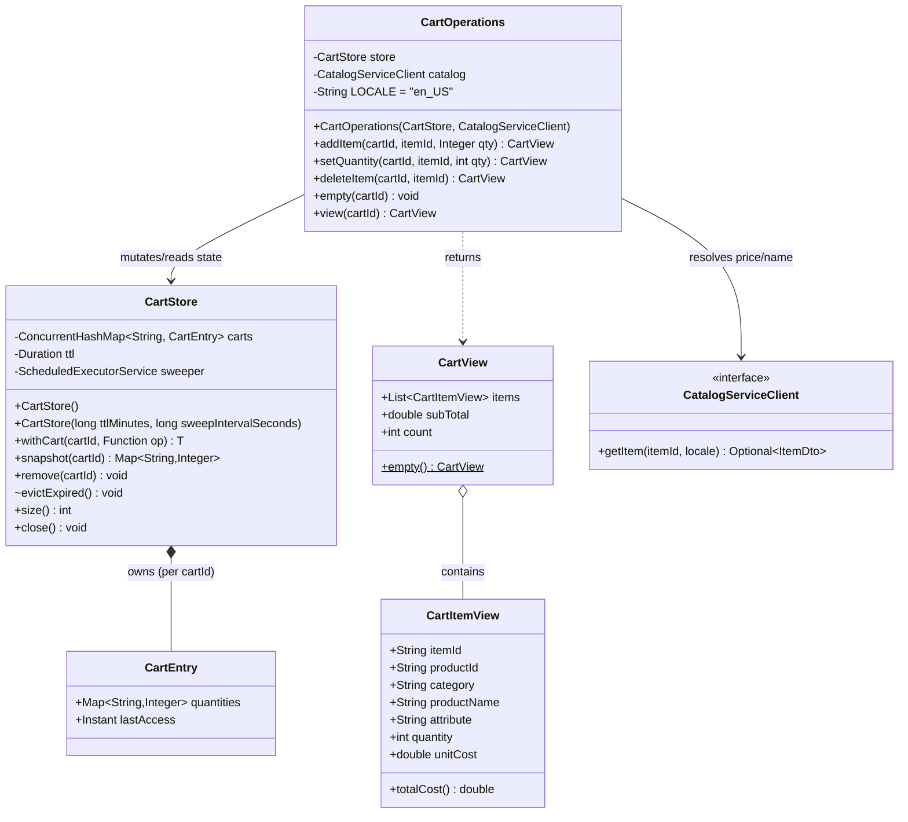
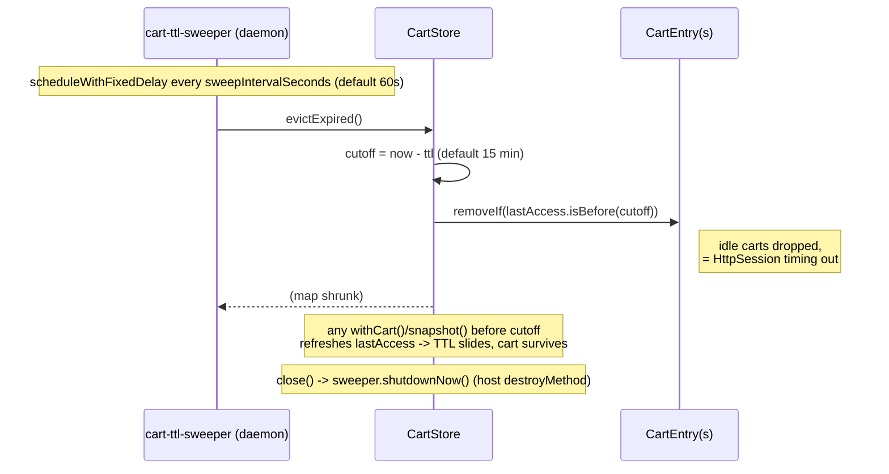

# cart-lib — Low-Level Design

The embeddable in-process shopping cart for the migrated Java Pet Store. It is a
**library** (no port, no `main`): the host application (petstore-app-v1) wires it as
beans and runs it in the same JVM. cart-lib is a faithful port of the legacy
`ShoppingCartLocalEJB` + `cart.model` behaviour.

> Repo-wide conventions live in the [`petstore-dev`](../../.claude/skills/petstore-dev/SKILL.md)
> skill; module-scoped conventions in [`../.claude/skills/cart-lib/SKILL.md`](../.claude/skills/cart-lib/SKILL.md);
> future-Claude guidance in [`../CLAUDE.md`](../CLAUDE.md). Parity baseline:
> [`../../docs/PARITY_AUDIT.md`](../../docs/PARITY_AUDIT.md); ADRs: [`../../DECISIONS.md`](../../DECISIONS.md).

## Class & schema diagrams

Generated from the real source by [`cart-lib_lld.py`](cart-lib_lld.py) (imports the shared
house-style lib `../../docs/lld_style.py`). Regenerate with `cd cart-lib/docs && python3 cart-lib_lld.py`.

- **Class diagram** —  — [PNG](cart-lib_class.png) ·
  [SVG](cart-lib_class.svg): the framework-free library core (`CartOperations`, `CartStore` +
  its `CartEntry`, `CartDtos`), the reused `catalog-service-client` SDK seam, and how
  petstore-app-v1 (`CartConfig`, `CartService`) wires and consumes it.
- **Data-model / wire-contract diagram** —  —
  [PNG](cart-lib_schema.png) · [SVG](cart-lib_schema.svg): cart-lib has **no database**, so this
  shows the in-memory model (`carts` map → `CartEntry` → `itemId→qty` lines with the sliding
  15-min TTL), the `CartView`/`CartItemView` wire records, and the qty≤0-removes / cap-999 /
  skip-dangling invariants.

## Overview

Three classes in package `com.petstore.cart`:

- **`CartStore`** — the state holder. A `ConcurrentHashMap<String, CartEntry>` keyed by
  `cartId`; each `CartEntry` is an insertion-ordered `itemId → quantity` map plus a
  last-access `Instant`. A daemon `ScheduledExecutorService` sweeps expired carts on a
  **sliding TTL** (default 15 min = legacy session timeout). Framework-free; `AutoCloseable`.
- **`CartOperations`** — the business logic. Keyed by `cartId`, it mutates state through
  `CartStore` and resolves item names/prices from catalog-service via `CatalogServiceClient`.
  A faithful port of the legacy shopping-cart EJB.
- **`CartDtos`** — wire records: `CartItemView` (one resolved line) and `CartView`
  (`items`, `subTotal`, `count`).

State (quantities) and presentation (resolved prices) are deliberately separated: the store
keeps only `itemId → qty`; prices/names are resolved lazily in `view()` so cart state never
goes stale against the catalog.

## Class diagram



`CartStore implements AutoCloseable`. `CartEntry` is a private static nested class of
`CartStore`; `CartItemView` and `CartView` are nested records of `CartDtos`.

## Sequence — add item / update quantity (incl. quantity 0 removal)

```mermaid
sequenceDiagram
    participant Host as petstore-app-v1 (CartService)
    participant Ops as CartOperations
    participant Store as CartStore
    participant Cat as CatalogServiceClient

    Note over Host,Ops: addItem(cartId, itemId, qty)
    Host->>Ops: addItem(cartId, "EST-1", qty)
    Ops->>Store: withCart(cartId, q -> q.put(itemId, qty==null ? 1 : qty))
    Note right of Store: computeIfAbsent creates entry;<br/>lastAccess = now (sliding TTL);<br/>null qty RESETS to 1 (not increment)
    Store-->>Ops: (mutated)
    Ops->>Ops: view(cartId)

    Note over Host,Ops: setQuantity(cartId, itemId, qty)
    Host->>Ops: setQuantity(cartId, "EST-1", qty)
    Ops->>Store: withCart(cartId, q -> { q.remove(itemId); if qty>0 q.put(itemId, qty) })
    alt qty > 0
        Note right of Store: absolute quantity set
    else qty <= 0
        Note right of Store: line SILENTLY removed (legacy behaviour)
    end
    Store-->>Ops: (mutated)

    Note over Ops,Cat: view(cartId) — resolve for display
    Ops->>Store: snapshot(cartId)
    Store-->>Ops: ordered {itemId -> qty} (TTL refreshed)
    loop each entry
        Ops->>Cat: getItem(itemId, "en_US")
        alt item present
            Cat-->>Ops: ItemDto(listPrice, ...)
            Note right of Ops: line added; subTotal += listPrice * qty
        else item missing (dangling)
            Cat-->>Ops: Optional.empty()
            Note right of Ops: SKIPPED — no error (but still counts toward count)
        end
    end
    Ops-->>Host: CartView(items, subTotal, count=distinct lines)
```

## Sequence — TTL expiry / eviction



## Cart operations

| Operation | Signature | Semantics |
|-----------|-----------|-----------|
| Add item | `addItem(cartId, itemId, Integer qty)` | Sets quantity to `qty`, or **1 when `qty` is null** — RESETS, never increments. Returns the resolved `CartView`. |
| Set quantity | `setQuantity(cartId, itemId, int qty)` | Sets an **absolute** quantity. `qty <= 0` silently **removes** the line (no error). |
| Delete line | `deleteItem(cartId, itemId)` | Removes one line by item id. |
| Empty | `empty(cartId)` | Drops the whole cart (`store.remove`) so it doesn't linger; returns void. |
| View | `view(cartId)` | Resolves lines against catalog; **skips items missing from the catalog** (no error). `subTotal` = Σ(listPrice × qty) over resolvable items; `count` = number of DISTINCT lines in the raw cart (dangling ids still count). |

Store-level helpers: `withCart` (atomic per-cart mutation + TTL refresh), `snapshot`
(ordered copy + TTL refresh), `remove`, `evictExpired` (package-visible for tests),
`size`, `close`.

## Design decisions / invariants

- **Session-scoped, not a singleton.** All state is partitioned by `cartId`; carts are
  isolated. cart-lib never keys on username (logged-out shoppers have carts) and holds no
  global cart state. The host issues the id (HttpOnly cookie in petstore-app-v1); the store
  only partitions by it.
- **15-minute sliding TTL = legacy session timeout.** Any touch refreshes `lastAccess`; the
  daemon sweeper evicts carts idle past the TTL, mirroring `HttpSession` expiry. 15 min is
  the parity default; the host exposes it as config but keeps 15 as the default.
- **Quantity semantics are legacy-faithful and pinned by tests:** null-qty add resets to 1;
  `setQuantity <= 0` removes; `setQuantity` is absolute.
- **Resolve late, skip dangling.** State stores only ids/quantities; prices/names resolve in
  `view()`. Items absent from the catalog are silently skipped from `items`/`subTotal` but
  still counted in `count` (legacy `getCount == cart.size()`). `unitCost` is the catalog
  **list price** (legacy `CartItem` quirk).
- **Framework-free domain.** No Spring/JPA/Jackson in the library; the host wires the beans.
  The sweeper is a plain daemon thread stopped via `close()` (host `destroyMethod`).
- **Concurrency.** `carts` is a `ConcurrentHashMap`; mutations synchronize on the per-cart
  `CartEntry`, so each cart's updates are atomic.

## Reusability & extensibility

**What is reused (and by whom).**

- **cart-lib is itself the reusable unit.** It ships as a plain jar (`com.petstore:cart-lib:1.0.0`,
  `install`ed to `~/.m2`) and is embedded by its single consumer, **petstore-app-v1**, which wires
  `CartStore` + `CartOperations` as Spring beans in `com.petstore.cart.config.CartConfig` and adapts
  them in `CartService`. Because the library is **framework-free** (no Spring/JPA/Jackson
  annotations anywhere in `com.petstore.cart`), any other JVM host — a future checkout service, a
  test harness, a CLI — can reuse the exact same cart semantics just by constructing
  `new CartOperations(new CartStore(), catalogClient)`. There is no hidden container coupling to
  unwind.
- **The `catalog-service-client` SDK is reused, not reimplemented.** `CartOperations` depends only
  on the `CatalogServiceClient` interface surface (`getItem(itemId, locale)`) and the `ItemDto`
  record from the shared SDK jar — the same SDK petstore-app-v1's `CatalogController` uses. cart-lib
  owns no URLs, no JSON shapes, and no HTTP code; price/name resolution rides entirely on the SDK
  contract. This is the reuse seam made visible in the class diagram (`CartOperations → CatalogServiceClient → ItemDto`).
- **`CartView` / `CartItemView` are the reused wire contract.** These records are the single shape
  every caller consumes; `CartService.toCartItems` maps them into the host's own `CartItem` view
  model without cart-lib knowing anything about the host's presentation types.
- **`CartStore` generalises state access via one higher-order method.** `withCart(cartId, Function<Map,T> op)`
  is the reused primitive: `snapshot`, `addItem`, `setQuantity`, and `deleteItem` are all expressed
  as lambdas over it, so per-cart atomicity and sliding-TTL refresh are implemented **once** and
  inherited by every operation.

**How it is extended safely.**

- **New cart operation:** add a method to `CartOperations` expressed as a `withCart(...)` lambda
  (mutate the `Map<String,Integer>`) and return `view(cartId)`. The store, TTL, concurrency, and
  cap logic (`capQuantity`) are reused unchanged — no new state plumbing.
- **New field on the wire contract:** because `CartView`/`CartItemView` are Java records mapped by
  component name, **adding** a component (e.g. a per-line discount) is backward-compatible for
  Jackson consumers; existing callers ignore it. Removing/renaming a component is a breaking change.
- **Swapping catalog resolution:** any implementation satisfying the `CatalogServiceClient` surface
  can be injected via the `CartOperations(store, catalog)` constructor — the tests do exactly this
  with a Mockito mock (and even a throwing client to prove `count()` never calls catalog). A caching
  or alternate-transport catalog client would drop in with no library edit.
- **Tuning lifetime without code:** the sliding-TTL and sweep cadence are constructor args
  (`CartStore(ttlMinutes, sweepIntervalSeconds)`); the host externalises them as
  `cart.ttl-minutes` / `cart.sweep-interval-seconds` (defaults 15 / 60 — the parity values). No new
  adapter is needed to retune eviction.
- **Alternative state backing (extension boundary, not yet built):** today `CartStore` is a single
  concrete in-memory class (there is deliberately **no** persistence port here — cart is
  session-local, like the legacy `HttpSession`). If a distributed/shared backing (e.g. Redis) were
  ever required, the clean seam is to extract a small store interface from `CartStore`'s public
  surface (`withCart` / `snapshot` / `remove` / `size` / `close`) and inject an implementation into
  `CartOperations` — the business logic and DTOs would not change. This mirrors the port/adapter
  `@Profile` swap used elsewhere in the fleet (see catalog-service / OPC `OrderStore`), and is called
  out here so the extension point is explicit rather than assumed.
