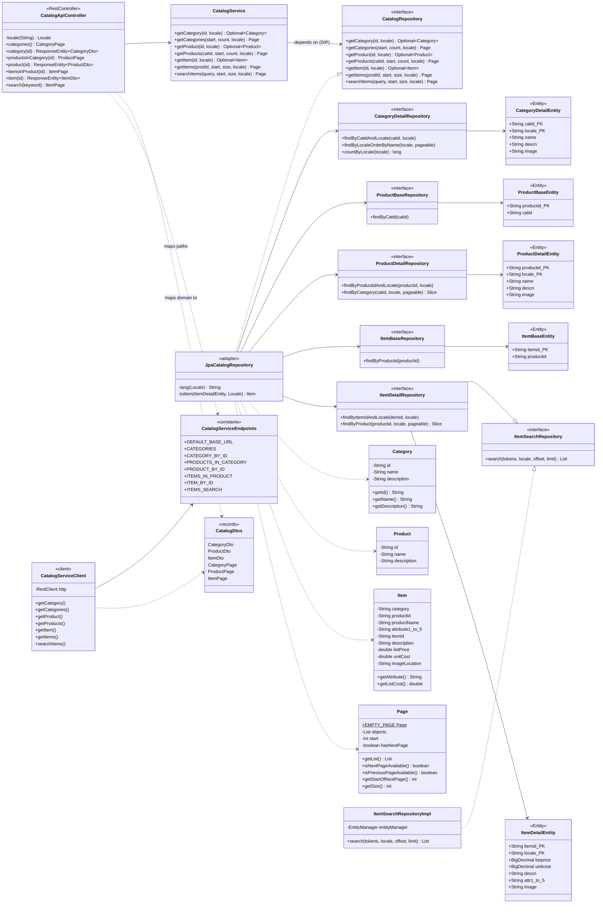
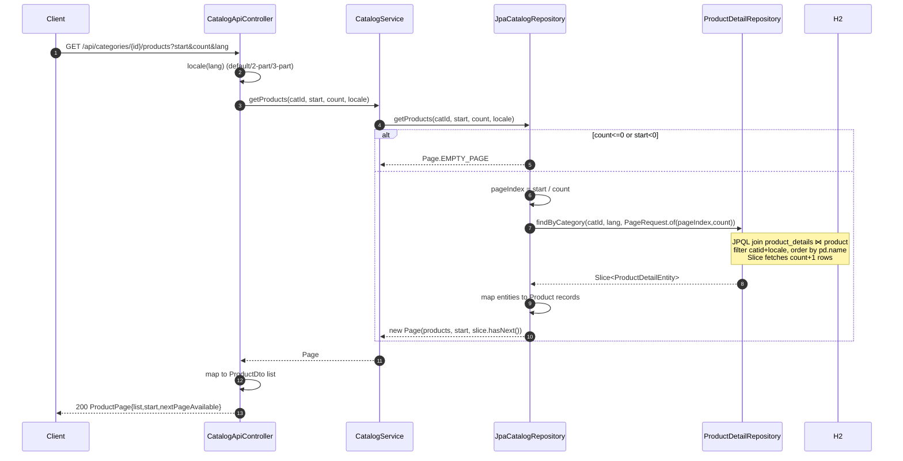
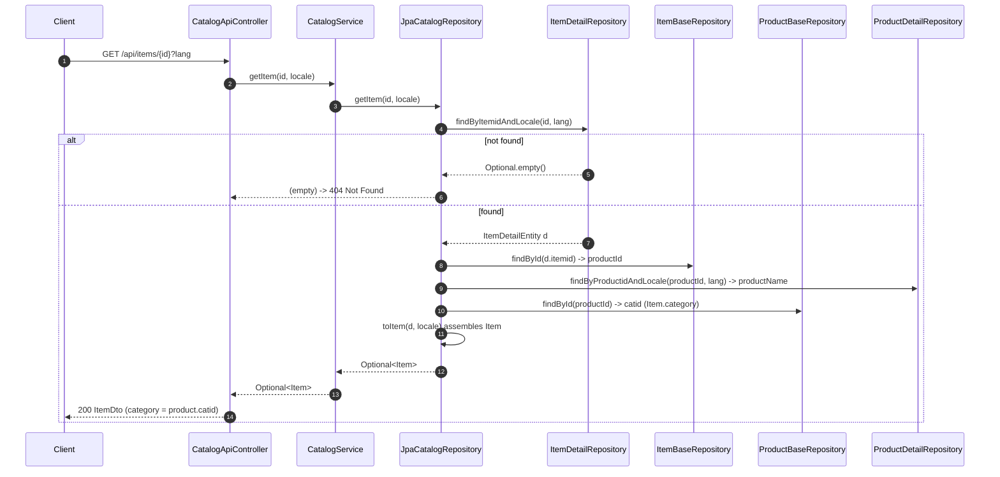

# catalog-service — Low-Level Design

Low-level design and class design for **catalog-service** (port **8083**,
package `com.petstore.catalog`), the read-only catalog/browse microservice
migrated from the legacy `CatalogEJB` / `CatalogDAO`. For cross-module context
see the shared skill `../../.claude/skills/petstore-dev/SKILL.md`; for the
future-Claude guide and invariants see `../CLAUDE.md`; parity rationale is in
`../../DECISIONS.md` and `../../docs/PARITY_AUDIT.md`.

## Overview

The service is a strict **hexagonal** slice: a framework-free domain, a single
persistence **port** (`CatalogRepository`), one JPA **adapter**, a pass-through
application service, and a REST controller. It is read-only — no writes, no JMS,
no auth. The `catalog-service-client` module (built first, then depended on by
`app`) single-sources the HTTP contract: the server maps the exact endpoint path
constants the clients call and reuses the same DTO records.

Two design themes dominate and are all parity-driven:

- **Locale-split storage** — each entity is a locale-independent *base* table plus
  a `(id, locale)`-keyed `_details` table. Every read is locale-scoped.
- **Legacy contract preservation** — misses return empty (never null/error);
  `searchItems` reproduces the legacy tokenized multi-field search; ordering is by
  name; pagination uses `Slice.hasNext()`.

## Class diagram



## Data model

Locale-split: a locale-independent **base** table carries identity + structural
FKs; a `(id, locale)` **`_details`** table carries localized text/pricing. DDL in
`app/resources/schema.sql`; seed (`en_US`, `ja_JP`, `zh_CN`) in `app/resources/data.sql`.

| Table | Key columns | Notable columns | Notes |
|-------|-------------|-----------------|-------|
| `category` | `catid` (PK) | — | category identity |
| `category_details` | `catid, locale` (PK) | `name, descn, image` | FK → `category.catid` |
| `product` | `productid` (PK) | `catid` (FK → category) | product→category membership |
| `product_details` | `productid, locale` (PK) | `name, descn, image` | FK → `product.productid` |
| `item` | `itemid` (PK) | `productid` (FK → product) | item→product membership |
| `item_details` | `itemid, locale` (PK) | `listprice, unitcost, descn, attr1..attr5, image` | FK → `item.itemid` |

Key joins used by the adapter:

- `getProducts`: `product_details ⋈ product` on `productid`, filter `product.catid`
  + `locale`, `order by product_details.name`.
- `getItems`: `item_details ⋈ item` on `itemid`, filter `item.productid` + `locale`,
  `order by item.itemid`.
- `getItem` category resolution: `item.productid → product.catid`; product name from
  `product_details(productid, locale)`.
- `searchItems`: 4-way join `item_details ⋈ item ⋈ product ⋈ product_details` on the
  shared locale, filtered by the dynamic OR-of-tokens clause.

## Sequence — list categories / products (paginated, ordered by name)



(`getCategories` is analogous but uses `findByLocaleOrderByName` + a
`countByLocale` total to compute `hasNext = start + size < total`.)

## Sequence — getItem (category resolution)



## Sequence — searchItems (tokenize → dynamic JPQL OR → Slice-style hasNext)

```mermaid
sequenceDiagram
    autonumber
    participant C as Client
    participant W as CatalogApiController
    participant S as CatalogService
    participant R as JpaCatalogRepository
    participant SR as ItemSearchRepositoryImpl
    participant EM as EntityManager

    C->>W: GET /api/items?keyword&start&count&lang
    W->>S: searchItems(keyword, start, count, locale)
    S->>R: searchItems(query, start, size, locale)
    alt query blank / size<=0 / start<0
        R-->>S: Page.EMPTY_PAGE
    else
        R->>R: tokens = query.trim().split("\\s+")
        alt no tokens
            R-->>S: Page.EMPTY_PAGE
        else
            R->>SR: search(tokens, lang, offset=start, limit=size+1)
            SR->>SR: build JPQL: per token OR (lower(pd.name) like :t<br/>OR lower(pb.catid) like :t OR lower(id.descn) like :t)
            Note over SR: attributes attr1..5 NOT searched
            SR->>EM: TypedQuery + setParameter(t_i=%tok%) + firstResult/maxResults
            EM-->>SR: List<ItemDetailEntity> (up to size+1)
            SR-->>R: rows
            R->>R: hasNext = rows.size() > size; take first size; toItem each
            R-->>S: new Page(items, start, hasNext)
        end
    end
    S-->>W: Page
    W-->>C: 200 ItemPage
```

## Endpoint table

All paths are `CatalogServiceEndpoints` constants; the controller `@GetMapping`s
reference the same constants (single-sourced). `lang` is optional on every
endpoint. Single-entity endpoints return **404** on miss; page endpoints return
**200** with a possibly-empty list.

| Method | Path (constant) | Query params | Returns | Miss |
|--------|-----------------|--------------|---------|------|
| GET | `/api/categories` (`CATEGORIES`) | `start=0`, `count=10`, `lang?` | `CategoryPage` | 200 empty |
| GET | `/api/categories/{id}` (`CATEGORY_BY_ID`) | `lang?` | `CategoryDto` | 404 |
| GET | `/api/categories/{id}/products` (`PRODUCTS_IN_CATEGORY`) | `start=0`, `count=10`, `lang?` | `ProductPage` | 200 empty |
| GET | `/api/products/{id}` (`PRODUCT_BY_ID`) | `lang?` | `ProductDto` | 404 |
| GET | `/api/products/{id}/items` (`ITEMS_IN_PRODUCT`) | `start=0`, `count=10`, `lang?` | `ItemPage` | 200 empty |
| GET | `/api/items/{id}` (`ITEM_BY_ID`) | `lang?` | `ItemDto` | 404 |
| GET | `/api/items` (`ITEMS_SEARCH`) | `keyword=""`, `start=0`, `count=10`, `lang?` | `ItemPage` | 200 empty |

### `lang` param handling (`CatalogApiController.locale`)

- null / blank → `Locale.US`.
- `"default"` (case-insensitive) → `Locale.getDefault()` (JVM default) — legacy
  `getLocaleFromString` behaviour (L4).
- split on `_`: 3 parts → `language_country_variant`, 2 parts → `language_country`,
  else `language` only. Adapter re-serializes via `Locale.toString()` (e.g. `en_US`)
  to match the `_details.locale` column.

## Design decisions & invariants

- **Port/adapter split (DIP + ISP).** `CatalogService` depends only on
  `CatalogRepository`; the JPA adapter is injected. The port is catalog-only and
  narrow. Domain records carry no framework annotations; entities never leak.
- **Miss ≠ error.** `Optional.empty()` / `Page.EMPTY_PAGE` → 404 / 200-empty.
- **Search (H6).** Whitespace tokenize; per-token OR of `LIKE %token%` across
  product **name** + category **catid** + item **descn**; tokens OR together;
  **attributes excluded**. Dynamic token count → runtime-assembled JPQL in
  `ItemSearchRepositoryImpl` (not a static derived query).
- **Ordering by name (M1).** `getCategories`/`getProducts` order by localized
  `name`; `getItems`/`searchItems` order by `itemid`.
- **Pagination via `Slice.hasNext()` (L5).** `getProducts`/`getItems` fetch
  count+1 through a `Slice`; `searchItems` fetches `size+1` and compares; only
  `getCategories` uses a count query. Prevents the phantom empty final page.
- **`getItem.category` from `product.catid` (M2).** Resolved via
  `item.productid → product.catid`, not hardcoded null.
- **Single-sourced contract.** `app` depends on `catalog-service-client`; server
  and clients share `CatalogServiceEndpoints` + `CatalogDtos`, so they cannot drift.
