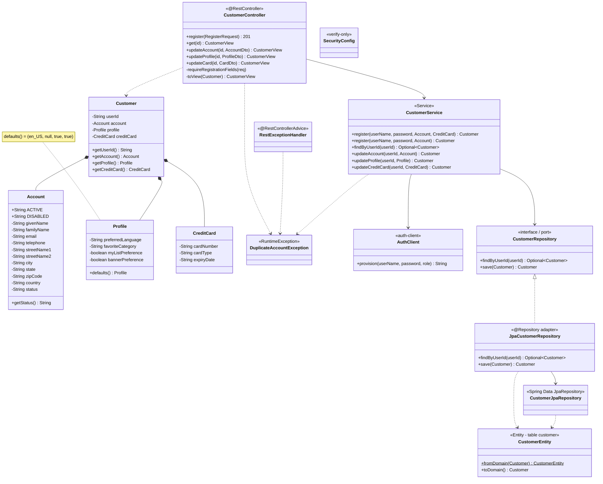
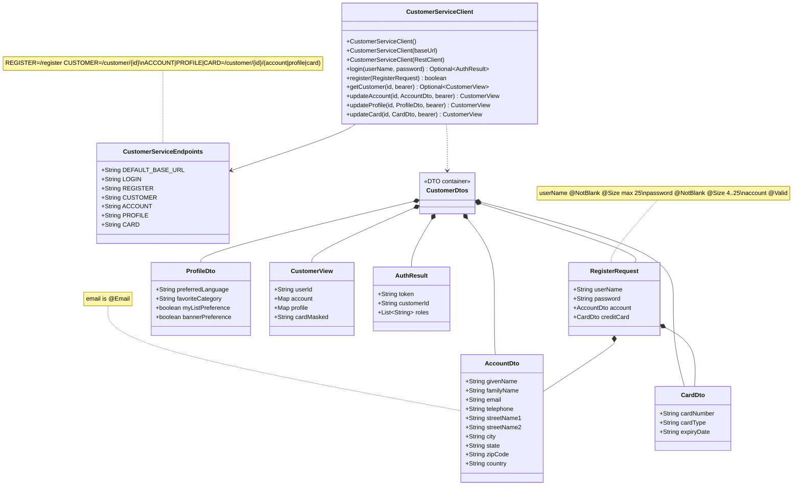
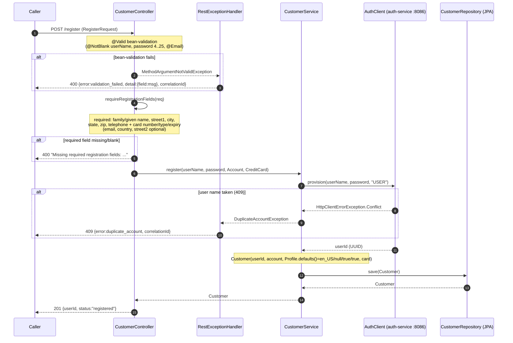
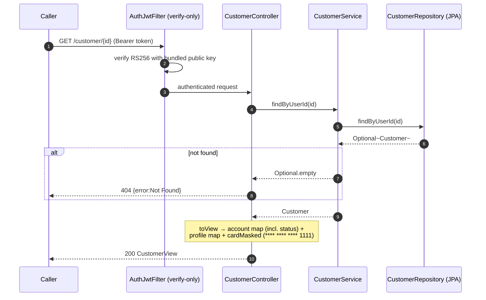
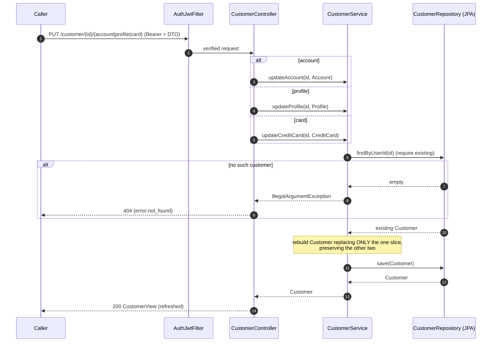

# customer-service — Low-Level Design

Migrated Pet Store **customer domain** microservice (Spring Boot 3.3.5 / Java 21, package
`com.petstore.customer`, port **8081**). This document covers the class design, data model,
request flows, and the design decisions/invariants specific to this module. For repo-wide
conventions see `../../.claude/skills/petstore-dev/SKILL.md`; for the parity baseline see
`../../docs/PARITY_AUDIT.md`; for ADRs see `../../DECISIONS.md`.

## Overview

customer-service owns the **customer aggregate** — contact/billing `Account` (with a
`status`), `Profile` preferences, and a `CreditCard` — keyed by an opaque `userId` (a UUID
minted by auth-service). It is a hexagonal (ports & adapters) service:

- **Domain** (`domain/`): framework-free value objects, no Spring/JPA/Jackson.
- **Application** (`service/`): `CustomerService` orchestrates registration + updates.
- **Inbound adapter** (`web/`): `CustomerController` + `RestExceptionHandler`.
- **Outbound adapters**: `repository/jpa/*` (persistence) and `auth-client`'s `AuthClient`
  (credential provisioning) behind the service.
- **Contract** (`client/` sub-module): the importable `customer-service-client` SDK —
  endpoint constants + DTOs + `CustomerServiceClient`, reused by the server so the two can
  never drift.

**Boundary:** credentials and tokens live in **auth-service**. customer-service is
verify-only (bundled RS256 public key via `AuthJwtFilter`) and provisions credentials at
registration. There is no `app_user` table here.

## Class diagram — server (domain + application + adapters)

## Class diagram — client SDK (`customer-service-client`, separate module)

> The server (`app`) imports this SDK and reuses `CustomerServiceEndpoints` +
> `CustomerDtos` directly in `CustomerController`, so endpoint paths and JSON shapes are
> single-sourced. `CustomerController` maps SDK DTOs to/from the framework-free domain
> (`toAccount`/`toCard`/`toView`); it never exposes the domain types over the wire.

## Data model

Single flattened table `customer` (`app/resources/schema.sql`; `ddl-auto: none`, schema
applied from SQL, H2 in-memory `jdbc:h2:mem:customer`). The legacy CMP graph
(Customer/Account/Profile/ContactInfo/Address/CreditCard) is collapsed into typed columns —
mapped by `CustomerEntity`.

| Group | Columns |
|-------|---------|
| key | `user_id` PK (VARCHAR 40, opaque UUID from auth-service) |
| account/contact | `given_name, family_name, email, telephone, street1, street2, city, state, zip_code, country` |
| **status** | `status` NOT NULL DEFAULT `'active'` (`active`/`disabled`) |
| profile | `preferred_language, favorite_category, my_list_pref, banner_pref` |
| card | `card_number, card_type, card_expiry` |

`data.sql` seeds **no** credentials (the central IdP holds all logins); customer rows are
created at registration. `CustomerEntity.toDomain()` defaults a null `status` to `active`
and returns a null `CreditCard` when all three card columns are null.

## Sequence — register (validation + defaults + provisioning)

## Sequence — read account (toView + masking)

## Sequence — update account / profile / card

## Endpoints

| Method | Path | Auth | Request | Response | Errors |
|--------|------|------|---------|----------|--------|
| POST | `/register` | public | `RegisterRequest` | 201 `{userId, status}` | 400 validation/missing fields, 409 duplicate |
| GET | `/customer/{id}` | Bearer | — | 200 `CustomerView` | 404 not found |
| PUT | `/customer/{id}/account` | Bearer | `AccountDto` | 200 `CustomerView` | 404 |
| PUT | `/customer/{id}/profile` | Bearer | `ProfileDto` | 200 `CustomerView` | 404 |
| PUT | `/customer/{id}/card` | Bearer | `CardDto` | 200 `CustomerView` | 404 |

`SecurityConfig` permits `/register`, `/h2-console/**`, `/actuator/**`; everything else
requires a verified token. Session policy is STATELESS; verification uses `AuthJwtFilter`
with the bundled public key. `LOGIN` (`/auth/login`) is a client-SDK constant pointing at
the auth flow — customer-service itself issues no tokens.

## Design decisions & invariants

1. **Domain data only; verify-only auth.** No credential/token storage or issuance. auth-service
   is the sole IdP; `AuthClient.provision` creates the credential (role `USER`) at registration.
2. **Framework-free domain vs JPA adapter.** `Account/Profile/CreditCard/Customer` carry no
   persistence annotations; `CustomerEntity` is the only `@Entity` and maps both directions.
3. **Profile defaults `(en_US, null, true, true)`** — legacy `ProfileLocalHome` parity (fix H8).
4. **`Account.status` `active`/`disabled`**, seeded `active` (fix M7); null column → `active`.
5. **Registration required-field guard** mirrors legacy `CustomerHTMLAction`
   (`extractContactInfo`/`extractCreditCard`): required contact + card fields; `email`,
   `country`, `streetName2` optional. Complements bean-validation on `RegisterRequest`.
6. **Card masking on read**; plaintext storage retained by parity decision (PCI tokenisation
   deferred — see DECISIONS.md).
7. **Slice-preserving updates** — each update replaces exactly one of account/profile/card.
8. **Single-sourced contract** — server reuses the client SDK's endpoints + DTOs.
9. **Uniform error shape + correlation id** — `RestExceptionHandler` emits
   `{status, error, detail, correlationId}`; `CorrelationIdFilter` sets/echoes
   `X-Correlation-Id`.
