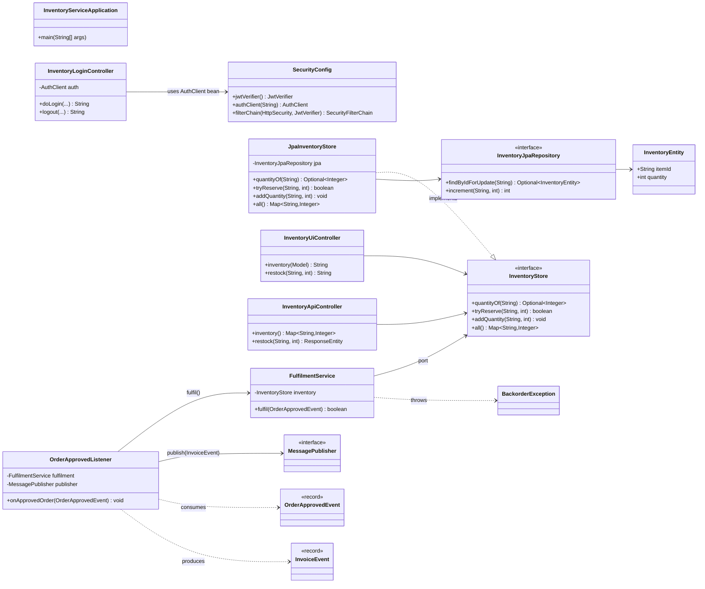
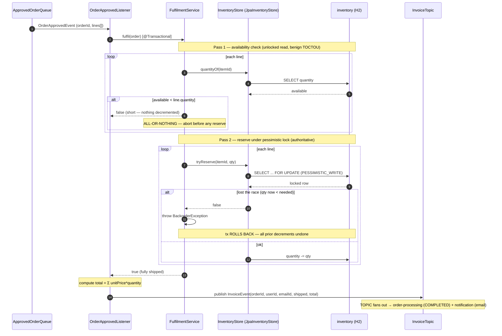
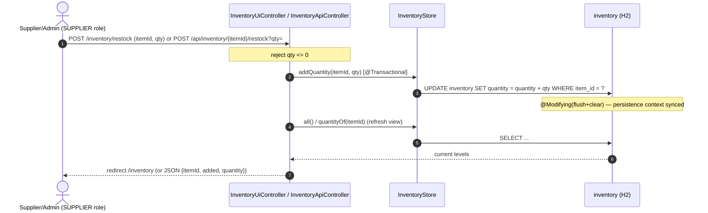

# inventory-service — Low-Level Design

Fulfilment + inventory service, migrated from the legacy **supplier.ear**
(`SupplierOrderMDB` + `OrderFulfillmentFacade` = fulfil/ship/invoice; `RcvrRequestProcessor`
= restock UI). Port **8085**, role **SUPPLIER** (ADMIN also allowed), package
`com.petstore.inventory`.

For the fleet-wide picture (JMS contract, order workflow, build/run) see the repo skill
[../../.claude/skills/petstore-dev/SKILL.md](../../.claude/skills/petstore-dev/SKILL.md) and
this module's [CLAUDE.md](../CLAUDE.md).

## Overview

The service is event-driven and hexagonal:

- **Inbound adapter** `OrderApprovedListener` consumes `OrderApprovedEvent` from
  **`ApprovedOrderQueue`** (a queue) and, after fulfilment, publishes an `InvoiceEvent` to
  **`InvoiceTopic`** (a topic).
- **Application core** `FulfilmentService` decides ship / no-ship **all-or-nothing** and
  reserves stock. It never touches JPA directly — it goes through the `InventoryStore` **port**.
- **Persistence adapter** `JpaInventoryStore` + `InventoryJpaRepository` implement the port,
  using a **pessimistic `SELECT … FOR UPDATE`** lock for the race-safe decrement.
- **Web** exposes the supplier restock UI + JSON API; **security** is verify-only RS256.

## Class design

Layer boundaries: **web/messaging** (adapters) → **service** (framework-light core) →
**repository** (port) → **repository.jpa** (adapter). The domain here is thin — stock is a
single scalar `quantity` per `itemId`, so the "domain model" is the `InventoryEntity` row plus
the `InventoryStore` contract; there is no separate aggregate class.

## Data model

Table `inventory` (owned by this service; `resources/schema.sql`):

| Column | Type | Notes |
|--------|------|-------|
| `item_id` | `VARCHAR(10)` | PK — the catalog item id (e.g. `EST-1`) |
| `quantity` | `INTEGER NOT NULL` | on-hand stock; `CHECK (quantity >= 0)` enforces the non-negative floor |

Quantity semantics:

- `quantityOf(itemId)` — current on-hand (empty Optional = unknown item, treated as 0 in `fulfil`).
- `tryReserve(itemId, qty)` — **decrement** on-hand by `qty` under a row lock; returns `false` (no
  change) if the item is unknown or `quantity < qty`. This is the only path that removes stock.
- `addQuantity(itemId, qty)` — **increment** on-hand (restock / receiver). Bulk `@Modifying` UPDATE
  with `flush+clear` so subsequent reads see the new value.

Seed (`resources/data.sql`): `EST-1=100, EST-2=1, EST-5=50, EST-10=50, EST-18=5`. `EST-2` is
deliberately seeded at 1 to exercise the oversell → backorder path.

## Sequence — approved-order intake → fulfil → invoice

Outcomes:

- **All lines available** → all decremented, `shipped=true`, order → COMPLETED.
- **Any line short (pass 1)** → nothing decremented, `shipped=false`; order stays APPROVED.
  This is the **oversell → backorder** outcome and is intentional (see below). Two concurrent
  orders racing the same scarce item: the pessimistic lock serialises them — one reserves and
  ships, the loser's `tryReserve` returns `false`/rolls back and backorders. Stock never goes
  negative.
- The `InvoiceEvent` is published **either way** — `shipped` carries the result so downstream
  can complete or notify a delay.

## Sequence — restock / receive

Restock is purely additive. **It does not re-trigger backordered orders** — there is no
persisted supplier PO and no reprocessing hook (PARITY_AUDIT H2/M8). A previously backordered
order is not automatically shipped when stock returns.

## Design decisions & invariants

| # | Decision | Source |
|---|----------|--------|
| All-or-nothing fulfilment | If any line is short, nothing ships and nothing is decremented; `shipped=false`, order stays APPROVED. **Intentional**, not a bug. The legacy `SHIPPED_PART` partial-ship state was removed as unreachable dead code and the `FulfilmentService` javadoc corrected. | DECISIONS.md; PARITY_AUDIT H1 |
| No backorder retry | Restock is additive only; no persisted supplier PO, no re-fulfil trigger. | PARITY_AUDIT H2, M8 |
| Pessimistic lock | `SELECT … FOR UPDATE` (`@Lock(PESSIMISTIC_WRITE)`) held across read-check-decrement in one `@Transactional`; closest to legacy EJB container-lock semantics; prevents oversell (verified 20-thread test). DB `CHECK (quantity >= 0)` is the floor. | ADR 27, 10 |
| Benign TOCTOU | `fulfil` does an unlocked first-pass read for a fast abort; the authoritative decision is the locked second pass. | PARITY_AUDIT notes |
| Idempotent consumer | JMS is at-least-once; terminal-state guard (COMPLETED/DENIED) lives in order-processing. `fulfil` must stay retry-safe. | ADR 29 |
| Always publish InvoiceEvent | Published on both ship and short-stock; `shipped` flag distinguishes. Enables backorder/delay notification (differs from legacy `if(invoice!=null)`). | PARITY_AUDIT L6 |
| flush+clear on increment | Bulk restock UPDATE syncs the persistence context so later reads see new stock. | ADR 30 |
| Verify-only auth | RS256 tokens verified with the bundled public key (`auth-client`); login delegates to auth-service; no local credential store. SUPPLIER/ADMIN on inventory endpoints. | SecurityConfig |

## See also

- [CLAUDE.md](../CLAUDE.md) — future-Claude guide for this module
- [.claude/skills/inventory-service/SKILL.md](../.claude/skills/inventory-service/SKILL.md) — scoped skill
- [../../.claude/skills/petstore-dev/SKILL.md](../../.claude/skills/petstore-dev/SKILL.md) — repo skill
- [../../DECISIONS.md](../../DECISIONS.md) · [../../docs/PARITY_AUDIT.md](../../docs/PARITY_AUDIT.md)
