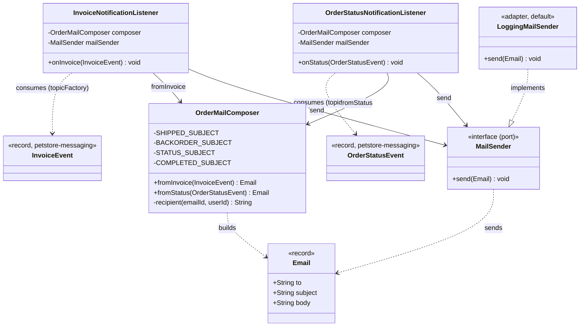
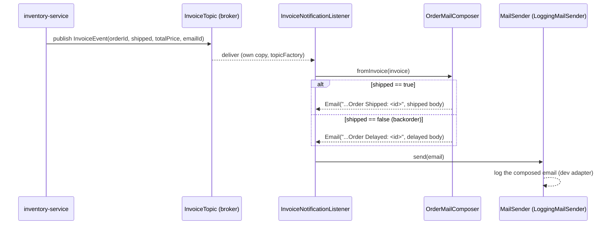
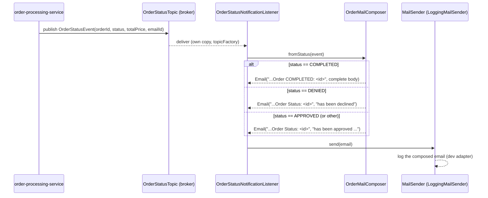

# notification-service — Low-Level Design

Customer email notifications for the migrated Pet Store. Port **8087**, package
`com.petstore.notification`. A **consumer-only** leaf service: two JMS topic subscribers
turn order events into customer emails through a mail **port/adapter** seam. It owns no
data, exposes no business API, and publishes nothing.

> Shared context (build/run, hexagonal rules, the JMS event contract, the parity rule)
> lives in the repo skill `../../.claude/skills/petstore-dev/SKILL.md`. Module-level Claude
> guidance is in `../CLAUDE.md`. Legacy behavioural baseline (gaps H3/H4/L7 this service
> closes) is in `../../docs/PARITY_AUDIT.md`; ADRs in `../../DECISIONS.md`.

## Responsibilities

- Subscribe to `InvoiceTopic` (`InvoiceEvent`) and email the customer that their order
  shipped, or is delayed on backorder — the legacy `MailInvoiceMDB`.
- Subscribe to `OrderStatusTopic` (`OrderStatusEvent`) and email the customer on
  approval/denial (legacy `MailOrderApprovalMDB`) or completion (legacy
  `MailCompletedOrderMDB`).
- Keep email **composition** (subject + body from an event) separate from **sending**
  (transport) so composition is unit-testable and the transport is swappable by config.

## Class design

`OrderMailComposer` and `Email` are pure/domain-ish (no transport). `MailSender` is the
outbound **port**; `LoggingMailSender` is the default dev **adapter**. The two listeners
are the inbound (JMS) adapters. This is the port/adapter seam:

The listeners depend only on the `MailSender` **interface** — swapping the adapter (log →
SMTP) requires no change to any notification logic. `@ConditionalOnMissingBean(name =
"smtpMailSender")` makes `LoggingMailSender` the default that backs off when a real sender
bean is present.

## Email types → subject strings → trigger

Subject strings are copied verbatim from the legacy MDBs and are the observable behaviour
under parity (see `OrderMailComposer`):

| Email type | Subject string (prefix + orderId) | Triggering event | Condition |
|------------|-----------------------------------|------------------|-----------|
| Order shipped | `Java Pet Store Order Shipped: ` | `InvoiceEvent` (`InvoiceTopic`) | `shipped == true` |
| Order delayed (backorder) | `Java Pet Store Order Delayed: ` | `InvoiceEvent` (`InvoiceTopic`) | `shipped == false` |
| Order status | `Java Pet Store Order Status: ` | `OrderStatusEvent` (`OrderStatusTopic`) | `status` = APPROVED or DENIED |
| Order completed | `Java Pet Store Order COMPLETED: ` | `OrderStatusEvent` (`OrderStatusTopic`) | `status == COMPLETED` |

`fromStatus` branches on `status`: COMPLETED gets the dedicated completed subject/body
(with total); DENIED reads "has been declined" and anything else "has been approved and is
being prepared for shipment", both under the generic status subject.

## Sequence — invoice → email

## Sequence — order status (approved / denied / completed) → email

## Design decisions / invariants

1. **Pub/sub, not point-to-point.** Both listeners bind with `containerFactory =
   "topicFactory"` (from the shared `MessagingConfig` in `petstore-messaging`), so each gets
   its own copy of every event and does not compete with sibling subscribers (e.g.
   order-processing's `InvoiceListener` on the same `InvoiceTopic`).
2. **Port/adapter seam for transport.** `MailSender` is the port; `LoggingMailSender` the
   default dev adapter. Real email = add a bean named `smtpMailSender`; no other code
   changes. This mirrors the legacy `MailHelper`/`MailerMDB` JavaMail seam.
3. **Composition ≠ sending.** `OrderMailComposer` returns an `Email` value and never
   touches transport, so subjects/bodies are testable without a broker or mail server.
4. **Legacy subject parity.** The four subject prefixes must not change — they are pinned
   to the legacy MDBs and to `../../docs/PARITY_AUDIT.md` gaps H3 (status), H4/L7
   (completed). The distinct COMPLETED subject is intentional, not redundant.
5. **Idempotent + consumes-only.** JMS is at-least-once; handlers are side-effect-safe
   (compose + log). The service publishes to no destination and stores no state. A real
   sender should dedupe on `meta.eventId`/`orderId`.
6. **Tolerant recipient resolution.** `recipient` falls back to
   `<userId|customer>@petstore.invalid` when `emailId` is blank — matches legacy tolerance
   of a missing address; never throws.
