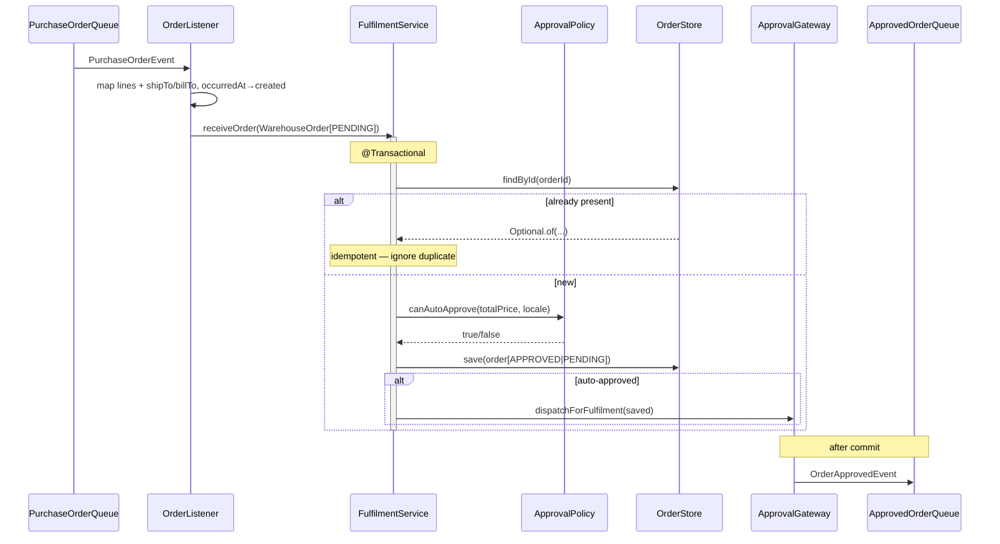
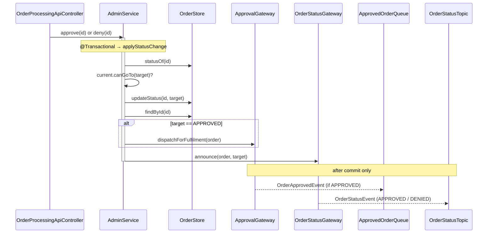
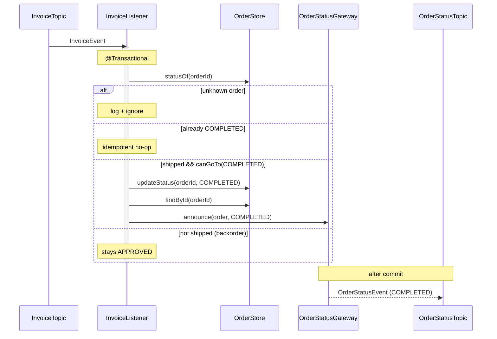
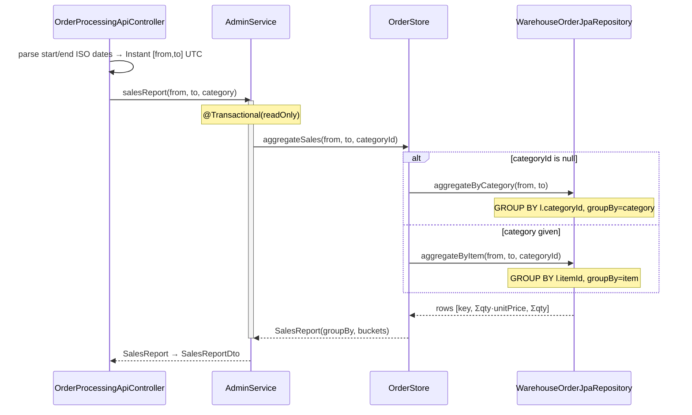

# order-processing-service — Low-Level Design

The **Order Processing Center (OPC)**, port **8088**, package `com.petstore.opc`. It is the
**authoritative order store + workflow engine**: it persists every order received from checkout,
decides auto-approval, drives the PENDING→APPROVED→COMPLETED (or PENDING→DENIED) lifecycle, and is the
only writer of order status in the fleet. Everyone else reacts to its events.

For system-wide context (module map, full JMS contract, hexagonal rules, build/run) see the repo skill
[`../../.claude/skills/petstore-dev/SKILL.md`](../../.claude/skills/petstore-dev/SKILL.md). Module-specific
Claude guidance is in [`../CLAUDE.md`](../CLAUDE.md); repo ADRs in [`../../DECISIONS.md`](../../DECISIONS.md);
parity baseline in [`../../docs/PARITY_AUDIT.md`](../../docs/PARITY_AUDIT.md).

## Class & schema diagrams

Generated by [`order-processing-service_lld.py`](order-processing-service_lld.py) on the shared
house-style library [`../../docs/lld_style.py`](../../docs/lld_style.py) — every class, field, table,
column, event and destination is extracted from the real source (`app/src`, `client/src`,
`resources/db/migration`). Regenerate with `cd docs && python3 order-processing-service_lld.py`.

- **Class diagram** — [`order-processing-service_class.png`](order-processing-service_class.png)
  ([svg](order-processing-service_class.svg)): the full hexagon — Web facade, Service layer with the
  **transactional-outbox write/read split** (`OutboxWriter` → `OutboxStore` → `OutboxRelay`), the two
  gateways, framework-free Domain, JMS listeners, the `OrderStore`/`OutboxStore` **ports each realized
  by two `@Profile` adapters** (JPA `!mongo` + Mongo), the reused client SDK, and the shared
  `petstore-messaging` / `auth-client` libraries.
- **Schema / data-model diagram** — [`order-processing-service_schema.png`](order-processing-service_schema.png)
  ([svg](order-processing-service_schema.svg)): the H2/JPA relational schema (`wh_order` + `wh_line` +
  `outbox`, Flyway V1–V4) side-by-side with the equivalent MongoDB document model (embedded `lines[]`),
  plus the outbound **event contract** (`OrderApprovedEvent`/`OrderStatusEvent` + `EventMeta`) that the
  `outbox.payload` JSON carries.

## Responsibilities

- **Intake** — `OrderListener` consumes `PurchaseOrderEvent` from `PurchaseOrderQueue`; `FulfilmentService`
  persists it and auto-approves (or leaves PENDING).
- **Approval** — auto (`ApprovalPolicy`) or manual (`AdminService.approve/deny/updateOrders` via the API).
- **Fulfilment dispatch** — `ApprovalGateway` publishes `OrderApprovedEvent` to `ApprovedOrderQueue`.
- **Completion** — `InvoiceListener` consumes `InvoiceEvent` from `InvoiceTopic` and completes the order.
- **Customer status announcements** — `OrderStatusGateway` publishes `OrderStatusEvent` to `OrderStatusTopic`.
- **Admin facade** — `OrderProcessingApiController` serves the SDK contract (list/detail/status/approve/deny/
  batch/sales), ADMIN-only.

## Class design

The domain layer is framework-free (records + enum + one policy `@Component`). JPA adapters map to/from
those records behind the `OrderStore` port. The `client` module is a separate artifact (wire DTOs +
endpoint constants + typed client), reused by the controller so the contract is single-sourced.

```mermaid
classDiagram
    direction LR

    %% ---------- domain (framework-free) ----------
    class WarehouseOrder {
        <<record>>
        +String orderId
        +String userId
        +String emailId
        +String locale
        +double totalPrice
        +OrderStatus status
        +List~OrderLine~ lines
        +ContactInfo shipTo
        +ContactInfo billTo
        +Instant created
    }
    class OrderStatus {
        <<enum>>
        PENDING
        APPROVED
        DENIED
        COMPLETED
        +boolean canGoTo(OrderStatus target)
    }
    class OrderLine {
        <<record>>
        +String itemId
        +String productId
        +String categoryId
        +int quantity
        +double unitPrice
    }
    class ContactInfo {
        <<record>>
        +String familyName
        +String givenName
        +String streetName1
        +String streetName2
        +String city
        +String state
        +String zipCode
        +String country
        +String telephone
        +String email
    }
    class OrderStatusChange {
        <<record>>
        +String orderId
        +OrderStatus newStatus
    }
    class SalesReport {
        <<record>>
        +String groupBy
        +List~SalesBucket~ buckets
    }
    class SalesBucket {
        <<record>>
        +String key
        +double revenue
        +int quantity
    }
    class ApprovalPolicy {
        <<Component>>
        +boolean canAutoApprove(double totalPrice, Locale locale)
    }

    WarehouseOrder --> OrderStatus
    WarehouseOrder "1" o-- "*" OrderLine
    WarehouseOrder --> ContactInfo : shipTo / billTo
    OrderStatusChange --> OrderStatus
    SalesReport "1" o-- "*" SalesBucket

    %% ---------- service ----------
    class FulfilmentService {
        <<Service>>
        +void receiveOrder(WarehouseOrder incoming)
    }
    class AdminService {
        <<Service>>
        +List~String~ ordersByStatus(OrderStatus)
        +void approve(String orderId)
        +void deny(String orderId)
        +void updateOrders(List~OrderStatusChange~)
        +OrderStatus statusOf(String orderId)
        +SalesReport salesReport(Instant start, Instant end, String categoryId)
        -void applyStatusChange(String orderId, OrderStatus target)
    }
    class ApprovalGateway {
        <<Component>>
        +void dispatchForFulfilment(WarehouseOrder)
    }
    class OrderStatusGateway {
        <<Component>>
        +void announce(WarehouseOrder, OrderStatus newStatus)
    }

    FulfilmentService --> ApprovalPolicy
    FulfilmentService --> ApprovalGateway
    FulfilmentService --> OrderStore
    AdminService --> OrderStore
    AdminService --> ApprovalGateway
    AdminService --> OrderStatusGateway

    %% ---------- messaging ----------
    class OrderListener {
        <<Component>>
        +void onOrder(PurchaseOrderEvent msg)
    }
    class InvoiceListener {
        <<Component>>
        +void onInvoice(InvoiceEvent invoice)
    }
    OrderListener --> FulfilmentService
    InvoiceListener --> OrderStore
    InvoiceListener --> OrderStatusGateway

    %% ---------- port ----------
    class OrderStore {
        <<interface / port>>
        +WarehouseOrder save(WarehouseOrder)
        +Optional~WarehouseOrder~ findById(String)
        +void updateStatus(String, OrderStatus)
        +Optional~OrderStatus~ statusOf(String)
        +List~String~ orderIdsByStatus(OrderStatus)
        +SalesReport aggregateSales(Instant start, Instant end, String categoryId)
    }

    %% ---------- jpa adapters (ports & adapters seam) ----------
    class JpaOrderStore {
        <<Repository>>
        -toDomain(WarehouseOrderEntity)
        -toEmbeddable(ContactInfo)
    }
    class WarehouseOrderEntity {
        <<Entity wh_order>>
        +String orderId
        +OrderStatus status
        +Instant created
        +ContactInfoEmbeddable shipTo
        +ContactInfoEmbeddable billTo
        +List~WarehouseLineEntity~ lines
    }
    class WarehouseLineEntity {
        <<Entity wh_line>>
        +Long id
        +String itemId
        +int quantity
        +double unitPrice
    }
    class ContactInfoEmbeddable {
        <<Embeddable>>
    }
    class WarehouseOrderJpaRepository {
        <<Spring Data>>
        +List findByStatus(OrderStatus)
        +List aggregateByCategory(Instant, Instant)
        +List aggregateByItem(Instant, Instant, String)
    }
    OrderStore <|.. JpaOrderStore
    JpaOrderStore --> WarehouseOrderJpaRepository
    WarehouseOrderJpaRepository --> WarehouseOrderEntity
    WarehouseOrderEntity "1" o-- "*" WarehouseLineEntity
    WarehouseOrderEntity --> ContactInfoEmbeddable : shipTo / billTo
    JpaOrderStore ..> WarehouseOrder : maps

    %% ---------- web + security ----------
    class OrderProcessingApiController {
        <<RestController>>
        +byStatus(status)
        +getOrder(id)
        +status(id)
        +approve(id)
        +deny(id)
        +updateOrders(OrderApprovalDto)
        +sales(start, end, category)
    }
    class SecurityConfig {
        <<Configuration>>
        +SecurityFilterChain filterChain(...)
    }
    OrderProcessingApiController --> AdminService
    OrderProcessingApiController --> OrderStore

    %% ---------- client module (separate artifact) ----------
    class OrderProcessingClient {
        <<client SDK>>
        +ordersByStatus(status, bearer)
        +getOrder(orderId, bearer)
        +approve(orderId, bearer)
        +deny(orderId, bearer)
        +updateOrders(OrderApprovalDto, bearer)
        +sales(start, end, category, bearer)
    }
    class OrderDtos {
        <<DTOs>>
        LineDto
        OrderView
        StatusView
        OrdersByStatus
        OrderStatusChangeDto
        OrderApprovalDto
        SalesBucketDto
        SalesReportDto
    }
    class OrderProcessingEndpoints {
        <<constants>>
        ORDERS
        ORDER_BY_ID
        ORDER_STATUS
        ORDER_APPROVE
        ORDER_DENY
        ORDER_APPROVALS
        SALES
    }
    OrderProcessingClient --> OrderDtos
    OrderProcessingClient --> OrderProcessingEndpoints
    OrderProcessingApiController ..> OrderDtos : reuses
    OrderProcessingApiController ..> OrderProcessingEndpoints : maps
```



## Persistence mapping

`WarehouseOrderEntity` (`@Entity`, table **`wh_order`**) is the persistence adapter for the domain
`WarehouseOrder`. `JpaOrderStore` converts both ways — `save` builds the entity + child
`WarehouseLineEntity` rows + two `ContactInfoEmbeddable`s; `toDomain` rebuilds the record. The domain
record never carries JPA annotations (hexagonal seam).

`ContactInfoEmbeddable` is `@Embedded` **twice** on the entity (ship-to and bill-to) with distinct column
prefixes via `@AttributeOverrides`. Its base column names (`family_name`, `given_name`, `street1`,
`street2`, `city`, `state`, `zip`, `country`, `telephone`, `email`) are overridden to `ship_*` / `bill_*`.

`wh_order` columns (from Flyway `db/migration/V1__init_order_schema.sql`, `ddl-auto: none` — schema is authoritative):

| Column | Maps to | Notes |
|--------|---------|-------|
| `order_id` (PK) | `WarehouseOrder.orderId` | order id from checkout |
| `user_id`, `email_id`, `locale` | same | |
| `total_price` DECIMAL(12,2) | `totalPrice` | |
| `status` VARCHAR(20) | `OrderStatus` | `@Enumerated(STRING)` |
| `created` TIMESTAMP | `created` (`Instant`) | order-received time (legacy `PurchaseOrder.poDate`); drives sales date-range |
| `ship_*` (10 cols) | `shipTo` (`ContactInfoEmbeddable`) | ship-to contact/address |
| `bill_*` (10 cols) | `billTo` (`ContactInfoEmbeddable`) | bill-to contact/address |

`wh_line` (table for `WarehouseLineEntity`): `id` (IDENTITY PK), `order_id` (FK via `@JoinColumn`),
`item_id`, `product_id`, `category_id`, `quantity`, `unit_price`. Lines are `EAGER`, `cascade=ALL`,
`orphanRemoval=true`. The sales `GROUP BY` queries join `wh_order` to `wh_line` on `created` range.

## Sequence diagrams

### 1. New-order intake (PurchaseOrderQueue → persist → auto-approve)



### 2. Admin approve / deny (API → after-commit publish)



### 3. Invoice → COMPLETED



### 4. Atomic batch approval (POST /api/orders/approvals)

```mermaid
sequenceDiagram
    participant C as OrderProcessingApiController
    participant AS as AdminService
    participant OS as OrderStore
    participant AG as ApprovalGateway
    participant SG as OrderStatusGateway

    C->>C: OrderApprovalDto → List~OrderStatusChange~
    C->>AS: updateOrders(changes)
    activate AS
    Note over AS: single @Transactional
    loop each change
        AS->>OS: statusOf(orderId)
        AS->>AS: canGoTo(newStatus)? else throw → rollback all
        AS->>OS: updateStatus(orderId, newStatus)
        AS->>OS: findById(orderId)
        alt APPROVED
            AS->>AG: dispatchForFulfilment(order)
        end
        AS->>SG: announce(order, newStatus)
    end
    deactivate AS
    Note over AG,SG: all publishes fire after the single commit;<br/>any illegal transition rolls back the whole batch
```

### 5. Sales aggregation query (GET /api/sales)



## Endpoints

All under ADMIN role (verified in `SecurityConfig`; the acting admin's forwarded JWT is checked with the
`auth-client` public key). Paths are constants in `OrderProcessingEndpoints`.

| Method | Path | Auth | Purpose |
|--------|------|------|---------|
| GET | `/api/orders?status=PENDING` | ADMIN | order ids by status (`OrdersByStatus`) |
| GET | `/api/orders/{id}` | ADMIN | full order detail (`OrderView`); 404 if absent |
| GET | `/api/orders/{id}/status` | ADMIN | just the status (`StatusView`); 404 if absent |
| POST | `/api/orders/{id}/approve` | ADMIN | PENDING → APPROVED, dispatch for fulfilment |
| POST | `/api/orders/{id}/deny` | ADMIN | PENDING → DENIED (terminal) |
| POST | `/api/orders/approvals` | ADMIN | atomic batch status update (`OrderApprovalDto`); all-or-nothing |
| GET | `/api/sales?start=&end=&category=` | ADMIN | date-range sales aggregation (`SalesReportDto`); category optional |
| GET | `/actuator/**`, `/error` | permit-all | health/info/metrics |

`start`/`end` are ISO `yyyy-MM-dd` inclusive, interpreted UTC (`end` expanded to end-of-day).

## Design decisions & invariants

- **Single order-status writer.** OPC owns `wh_order.status`; other services react to events. Legacy split
  the status across `OPC` + `ManagerEJBTable` — collapsed here.
- **Status set is closed:** PENDING / APPROVED / DENIED / COMPLETED. `SHIPPED_PART` was **intentionally
  removed** (all-or-nothing fulfilment moved to inventory-service) — do not reintroduce. See DECISIONS.md.
- **After-commit publishing** via `TransactionSynchronization` in both gateways — a rolled-back txn never
  emits `OrderApprovedEvent` or `OrderStatusEvent`. The batch path relies on this: one commit, then all sends.
- **Idempotent consumers** — `OrderListener` (dedupe on `findById`) and `InvoiceListener` (no-op if already
  COMPLETED) tolerate JMS at-least-once redelivery.
- **`ApprovalPolicy`** is legacy-faithful (`PurchaseOrderMDB.canIApprove`): US `< 500`, JAPAN `< 50000`,
  else PENDING for manual approval.
- **`WarehouseOrder` 10-arg record** — every construction site is positional; changing its shape means
  updating `FulfilmentService`, `OrderListener`, `JpaOrderStore`, and both tests together.
- **Contract single-sourced** — the controller imports the `client` module's DTOs + endpoint constants,
  so server and callers cannot drift.
- **Verify-only security** — no credential store, no token issuance here; OPC only verifies RS256 tokens.

## Reusability & extensibility

> The class diagram above makes these seams visual: gold = ports, amber = adapters, soft-blue = the
> reused client SDK, grey-framework = shared libraries.

### What is reused

- **`petstore-messaging` (shared contract library).** OPC never hardcodes a destination name, event
  shape, or `_type` id. `ApprovalGateway`/`OrderStatusGateway` build `OrderApprovedEvent` /
  `OrderStatusEvent` and target `Destinations.APPROVED_ORDER` / `Destinations.ORDER_STATUS`;
  `OutboxWriter` derives the `_type` id by **inverting `MessagingConfig.TYPE_IDS`** (the same map the
  wire converter uses) and `OutboxRelay` maps it back the same way, so the relay's JMS message is
  byte-identical to a direct publish. `OutboxRelay` publishes through the shared `MessagePublisher`.
  `EventMeta` (envelope) and `Correlation` (MDC id) come from the same library and are reused by every
  listener + `CorrelationIdFilter`.
- **`auth-client` (shared security library).** `SecurityConfig` reuses `JwtVerifier` + `AuthJwtFilter`
  + `AuthPublicKey.bundled()` for verify-only RS256 auth — no local key or credential store.
- **`order-processing-client` SDK (this module's own `client/` artifact).** `OrderProcessingClient` +
  `OrderDtos` + `OrderProcessingEndpoints` are a separate published artifact reused by **two callers**:
  admin-office-service (the admin console) and OPC's *own* `OrderProcessingApiController`, which imports
  the same DTOs + path constants so the HTTP contract is **single-sourced** and server/clients cannot
  drift. The storefront reuses `checkout(...)` / `CheckoutRequest` for synchronous intake.
- **Internal reuse.** `AdminService.applyStatusChange` is the one validated-transition helper shared by
  the per-order (`approve`/`deny`), batch (`updateOrders`), and the mapping is identical to the intake
  path via the shared `FulfilmentService.receiveOrder` (both the REST `/intake` and the `OrderListener`
  queue path converge on it). The JPA/Mongo adapters share the `MongoSchema` constant registry so the
  document mapping, aggregation queries, and validators stay in lockstep.

### How it is extended safely

- **New persistence store → new adapter behind a port.** `OrderStore` / `OutboxStore` are the SPI
  seams. A new backend (e.g. Postgres) is a new `@Profile`-gated class implementing the port — the
  service, messaging, and domain layers are untouched because they only ever see the port. This is
  exactly how the `mongo` profile was added: `MongoOrderStore`/`MongoOutboxStore` (`@Profile("mongo")`)
  sit beside `JpaOrderStore`/`JpaOutboxStore` (`@Profile("!mongo")`), and each profile's
  `application.yml` document excludes the other's autoconfig so **exactly one bean exists per profile**.
- **New outbound event → through the outbox, never a direct publish.** Register the event class in
  `MessagingConfig.TYPE_IDS`, then call `OutboxWriter.enqueue(destination, event, orderId)` from inside
  the business transaction. `OutboxRelay` picks it up generically (it routes by the stored `event_type`),
  so no relay change is needed — this preserves invariant #3 (atomic enqueue) and at-least-once delivery.
- **New event field → additive/nullable.** `WarehouseOrder`, the DTOs, and the events add fields at the
  end (e.g. `currency` was appended to `PurchaseOrderEvent`, `OrderView`, and the `wh_order` table via
  Flyway `V4`), so older producers/consumers still deserialize. Schema changes are versioned Flyway
  migrations (H2) or a widened `$jsonSchema` validator applied on `ApplicationReadyEvent` (Mongo).
- **New workflow reaction → new `@JmsListener` + a unique durable subscription name.** `RestockListener`
  was added to `RestockTopic` (subscription `opc-restock`) and simply delegates to the existing
  `AdminService.redriveApprovedForFulfilment()` → `ApprovalGateway` → outbox pipeline — zero new
  fulfilment logic. Any new topic subscriber just needs a distinct `subscription` name to keep fan-out.
- **New workflow status/transition** is a single edit to the `OrderStatus` enum + its `canGoTo` map
  (the chokepoint enforced in both stores' `updateStatus`); the Mongo validator enum derives from it
  automatically via `MongoSchema.ORDER_STATUSES`.
- **New REST endpoint** adds a constant to `OrderProcessingEndpoints`, a handler on the controller, and
  (if needed) a method on the client SDK — the shared-constant discipline keeps both ends aligned.
  Error mapping is centralized in `ApiExceptionHandler` (400/409), so new handlers inherit it for free.
