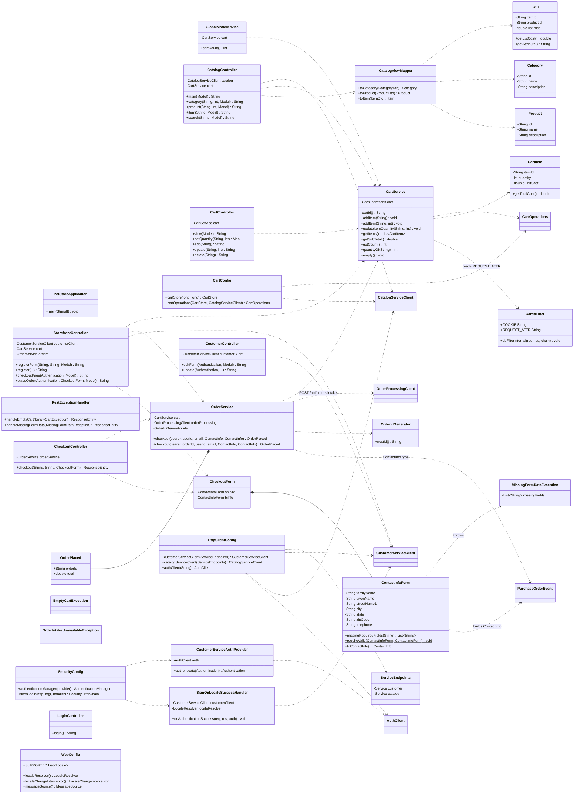
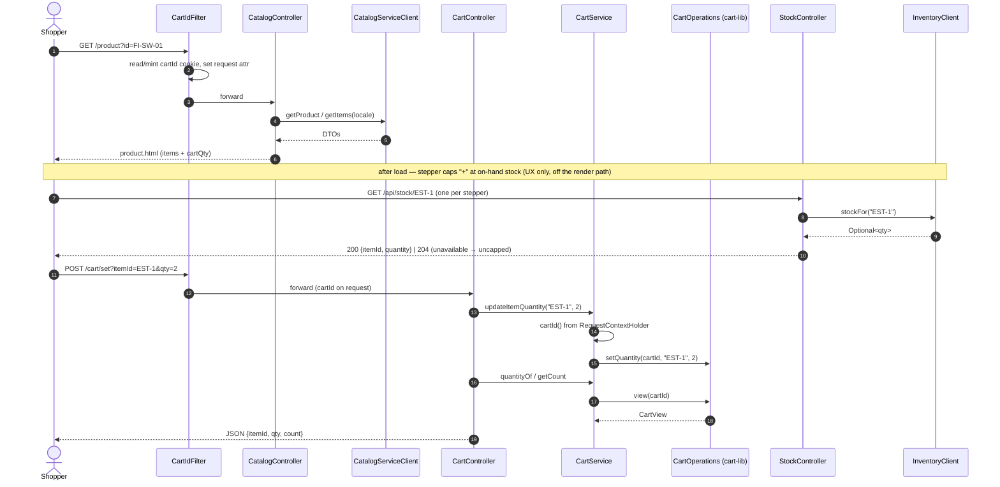
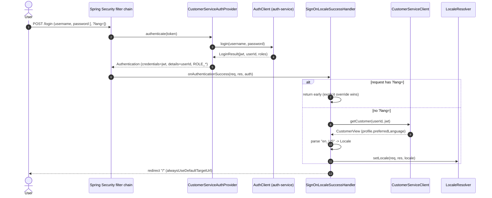

# petstore-app-v1 — Low-Level Design

The **:8080 storefront**: HTML shopping UI (browse → cart → checkout), sign-on/registration, and
account self-service. It is a **client** of the shared Artemis broker (`:61616`), which runs as a
standalone container — the storefront does not host it. Package root `com.petstore`; Spring Boot
3.3.5 / Java 21. See the repo `petstore-dev` skill for shared conventions and
[`../CLAUDE.md`](../CLAUDE.md) for the invariant list.

## 1. Responsibilities

- Render the storefront (Thymeleaf): catalog browse/search, cart, checkout, login, registration,
  account edit — localised en/ja/zh.
- Own the shopping cart lifecycle in-process via **cart-lib**, keyed by an anonymous cart-id cookie.
- Delegate all domain data: catalog → catalog-service, customer → customer-service, auth → auth-service.
- **No order persistence:** checkout is a **synchronous REST intake** — build a `CheckoutRequest`
  from the cart and `POST /api/orders/intake` to OPC (via `order-processing-client`); the storefront
  stores **nothing** (the OPC on :8088 is the order store).
- Connect to the shared standalone ActiveMQ Artemis broker as a **client** (no broker server here).

## 2. Class diagram



## 3. Sequence diagrams

### 3.1 Browse → add to cart (in-page stepper)



### 3.2 Checkout → synchronous REST intake to OPC (with address validation)

```mermaid
sequenceDiagram
    autonumber
    actor Shopper
    participant SC as StorefrontController
    participant CustSDK as CustomerServiceClient
    participant Form as ContactInfoForm
    participant OS as OrderService
    participant Cart as CartService
    participant OpcSDK as OrderProcessingClient
    participant OPC as order-processing-service (:8088)

    Shopper->>SC: POST /checkout (shipTo.*, billTo.*) [authenticated]
    SC->>CustSDK: getCustomer(userId, JWT)
    CustSDK-->>SC: CustomerView (email)
    SC->>Form: requireValid(shipTo, billTo)
    alt any required field blank
        Form-->>SC: throw MissingFormDataException(missing)
        SC-->>Shopper: re-render checkout.html with error
    else all required present
        Form-->>SC: ok (blank optionals -> null)
        SC->>OS: checkout(bearer, userId, email, shipTo.toContactInfo(), billTo.toContactInfo())
        OS->>Cart: getItems()
        alt cart empty
            Cart-->>OS: []
            OS-->>SC: throw EmptyCartException
            SC-->>Shopper: checkout.html "cart is empty"
        else has items
            OS->>OS: OrderIdGenerator.nextId(); build CheckoutRequest (lines + total; locale=US)
            OS->>OpcSDK: checkout(request, bearer)
            alt OPC reachable
                OpcSDK->>OPC: POST /api/orders/intake (JWT proxied)
                OPC-->>OpcSDK: CheckoutResponse(orderId)
                OS->>Cart: empty()
                OS-->>SC: OrderPlaced(orderId, total)
                SC-->>Shopper: order_complete.html (status=SUBMITTED)
            else OPC down / breaker open
                OpcSDK-->>OS: RestClientException
                OS-->>SC: throw OrderIntakeUnavailableException (cart NOT emptied)
                SC-->>Shopper: 503 / retry notice
            end
        end
    end
```

### 3.3 Sign-on → apply locale



## 4. Request / route table

| Method | Path | Handler | Auth | Notes |
|--------|------|---------|------|-------|
| GET | `/` | `CatalogController.main` | public | category list (locale-aware) |
| GET | `/category` | `CatalogController.category` | public | `?id=`, `?start=` |
| GET | `/product` | `CatalogController.product` | public | `?id=`, seeds cart qty |
| GET | `/item` | `CatalogController.item` | public | `?id=`; composes coarse stock badge (`resolveStock`) |
| GET | `/search` | `CatalogController.search` | public | `?keyword=` |
| GET | `/api/stock/{itemId}` | `StockController.stock` | public | after-load stepper cap; proxies `InventoryClient`; `204` when unavailable |
| GET | `/cart` | `CartController.view` | public | full cart page |
| POST | `/cart/set` | `CartController.setQuantity` | public | JSON; qty≤0 removes |
| POST | `/cart/add` | `CartController.add` | public | redirect to `/cart` |
| POST | `/cart/update` | `CartController.update` | public | redirect to `/cart` |
| POST | `/cart/delete` | `CartController.delete` | public | redirect to `/cart` |
| GET | `/login` | `LoginController.login` | public | renders form; POST `/login` handled by Security |
| POST | `/login` | (Spring Security) | public | success → `SignOnLocaleSuccessHandler` |
| POST | `/logout` | (Spring Security) | any | invalidates session, clears `JSESSIONID` |
| GET | `/register-form` | `StorefrontController.registerForm` | public | captures returnUrl/Referer (L2) |
| POST | `/register-form` | `StorefrontController.register` | public | → customer-service; return to origin |
| GET | `/checkout` | `StorefrontController.checkoutPage` | **authenticated** | summary + saved address |
| POST | `/checkout` | `StorefrontController.placeOrder` | **authenticated** | validate + REST intake to OPC |
| POST | `/api/checkout` | `CheckoutController.checkout` | permitAll* | JSON alt; `userId`/`email` params |
| GET | `/customer` | `CustomerController.editForm` | **authenticated** | account edit form (M4) |
| POST | `/customer` | `CustomerController.update` | **authenticated** | update account/profile/card |

\* `/api/checkout` is not matched by the `authenticated()` rule (only exact `/checkout` is), so it
falls through to `anyRequest().permitAll()`. CSRF is disabled for `/checkout`, `/cart/**`, `/admin/**`.

## 5. Key design decisions & invariants

- **No order persistence (OPC owns the store).** `OrderService` does a synchronous REST intake
  (`POST /api/orders/intake` on OPC via `order-processing-client`) and never persists. No JPA in
  `pom.xml`; order status/lookup is owned by the OPC. Do not add persistence or status endpoints
  here. OPC unreachable → `OrderIntakeUnavailableException` (clean 503, cart left intact). (See `DECISIONS.md`.)
- **Broker client.** Artemis runs `mode: native` with `embedded.enabled: false`, connecting to the
  standalone broker container on `${BROKER_URL:tcp://localhost:61616}`. No broker server is hosted
  here; tests override to an in-VM embedded broker so `mvn test` needs no container.
- **Cart identity = cookie, not HTTP session.** `CartIdFilter` mints an HttpOnly 128-bit SecureRandom
  `cartId` cookie; `CartService` resolves it per request and delegates to in-process cart-lib. Works
  for logged-out shoppers and survives login. Subtotal uses list price (`CartItem.unitCost` = list cost).
- **H7 address validation.** Ship-to + bill-to each require family/given name, street1, city, state,
  zip, telephone (14 total); street2/country/email optional, blanks → null. Missing →
  `MissingFormDataException` (HTML re-render, or 400 JSON via `RestExceptionHandler`).
- **H9 sign-on locale, `?lang=` wins.** `SignOnLocaleSuccessHandler` applies stored
  `preferredLanguage` only when no `?lang=` param is present.
- **Delegated auth.** No local credentials/`UserDetailsService`; JWT is the `Authentication`
  credential (forwarded as Bearer), stable `userId` on `getDetails()`.
- **i18n.** Locales `en_US`/`ja_JP`/`zh_CN` only; cookie `lang` + `?lang=` interceptor; UI text in
  `messages_*.properties`; catalog text localised by catalog-service. Add new keys to all bundles.
