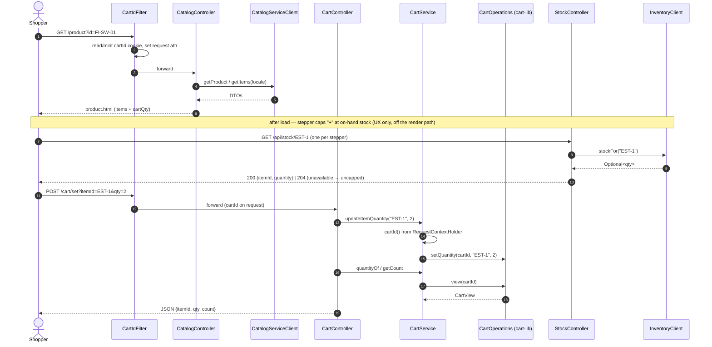
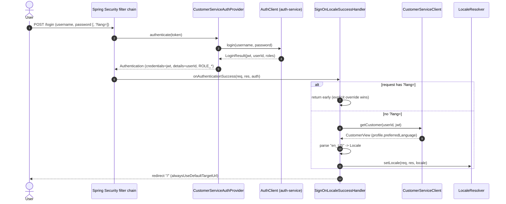

# petstore-app-v1 — Low-Level Design

The **:8080 storefront**: HTML shopping UI (browse → cart → checkout), sign-on/registration, and
account self-service. It is a **client** of the shared Artemis broker (`:61616`), which runs as a
standalone container — the storefront does not host it. Package root `com.petstore`; Spring Boot
3.3.5 / Java 21. See the repo `petstore-dev` skill for shared conventions and
[`../CLAUDE.md`](../CLAUDE.md) for the invariant list.

## Class & schema diagrams

Generated from the real source by [`petstore-app-v1_lld.py`](petstore-app-v1_lld.py) on the shared
[`docs/lld_style.py`](../../docs/lld_style.py) house-style library. Re-run with
`cd petstore-app-v1/docs && python3 petstore-app-v1_lld.py`.

- **Class / layering** — [`petstore-app-v1_class.png`](petstore-app-v1_class.png) ·
  [`petstore-app-v1_class.svg`](petstore-app-v1_class.svg): the layered storefront — HTML `@Controller`s
  and JSON `@RestController`s over the application services (`OrderService`, `CartService`,
  `IdempotencyKeyStore`, `OrderKeyCipher`, `OrderIdGenerator`), the framework-free view models/forms,
  the delegated-auth + cart-id security layer, and the config/resilience wiring. It makes the **reuse**
  seam obvious: five imported client-SDK jars + the in-process `cart-lib` + the shared
  `petstore-messaging` contract type, all composed through `HttpClientConfig`/`CartConfig` over one
  `ResilientRestClient`.
- **Data model (no DB)** — [`petstore-app-v1_schema.png`](petstore-app-v1_schema.png) ·
  [`petstore-app-v1_schema.svg`](petstore-app-v1_schema.svg): this module persists **nothing** in a
  database. The diagram shows the owned in-memory / session state (the `cartId`/`JSESSIONID`/`lang`
  cookies, cart-lib's `CartEntry`, the `IdempotencyKeyStore.Reservation`, and the AES/GCM `orderKey`
  token) alongside the DTO/wire contracts it composes — the outbound `CheckoutRequest` (→ OPC intake),
  the customer `RegisterRequest`/`AccountDto`/`CardDto`, and the read shapes (`CartView`,
  `LoginResult`, `CustomerView`, the stock read) — with the data-flow from session state into those
  contracts at checkout.

## 1. Responsibilities

- Render the storefront (Thymeleaf): catalog browse/search, cart, checkout, login, registration,
  account edit — localised en/ja/zh.
- Own the shopping cart lifecycle in-process via **cart-lib**, keyed by an anonymous cart-id cookie.
- Delegate all domain data: catalog → catalog-service, customer → customer-service, auth → auth-service.
- **No order persistence:** checkout is a **synchronous REST intake** — build a `CheckoutRequest`
  from the cart and `POST /api/orders/intake` to OPC (via `order-processing-client`); the storefront
  stores **nothing** (the OPC on :8088 is the order store).
- Connect to the shared standalone ActiveMQ Artemis broker as a **client** (no broker server here).

## 2. Class diagram


## 3. Sequence diagrams

### 3.1 Browse → add to cart (in-page stepper)



### 3.2 Checkout → synchronous REST intake to OPC (with address validation)

```mermaid
sequenceDiagram
    autonumber
    actor Shopper
    participant SC as StorefrontController
    participant CustSDK as CustomerServiceClient
    participant Form as ContactInfoForm
    participant OS as OrderService
    participant Cart as CartService
    participant OpcSDK as OrderProcessingClient
    participant OPC as order-processing-service (:8088)

    Shopper->>SC: POST /checkout (shipTo.*, billTo.*) [authenticated]
    SC->>CustSDK: getCustomer(userId, JWT)
    CustSDK-->>SC: CustomerView (email)
    SC->>Form: requireValid(shipTo, billTo)
    alt any required field blank
        Form-->>SC: throw MissingFormDataException(missing)
        SC-->>Shopper: re-render checkout.html with error
    else all required present
        Form-->>SC: ok (blank optionals -> null)
        SC->>OS: checkout(bearer, userId, email, shipTo.toContactInfo(), billTo.toContactInfo())
        OS->>Cart: getItems()
        alt cart empty
            Cart-->>OS: []
            OS-->>SC: throw EmptyCartException
            SC-->>Shopper: checkout.html "cart is empty"
        else has items
            OS->>OS: OrderIdGenerator.nextId(); build CheckoutRequest (lines + total; locale=US)
            OS->>OpcSDK: checkout(request, bearer)
            alt OPC reachable
                OpcSDK->>OPC: POST /api/orders/intake (JWT proxied)
                OPC-->>OpcSDK: CheckoutResponse(orderId)
                OS->>Cart: empty()
                OS-->>SC: OrderPlaced(orderId, total)
                SC-->>Shopper: order_complete.html (status=SUBMITTED)
            else OPC down / breaker open
                OpcSDK-->>OS: RestClientException
                OS-->>SC: throw OrderIntakeUnavailableException (cart NOT emptied)
                SC-->>Shopper: 503 / retry notice
            end
        end
    end
```

### 3.3 Sign-on → apply locale



## 4. Request / route table

| Method | Path | Handler | Auth | Notes |
|--------|------|---------|------|-------|
| GET | `/` | `CatalogController.main` | public | category list (locale-aware) |
| GET | `/category` | `CatalogController.category` | public | `?id=`, `?start=` |
| GET | `/product` | `CatalogController.product` | public | `?id=`, seeds cart qty |
| GET | `/item` | `CatalogController.item` | public | `?id=`; composes coarse stock badge (`resolveStock`) |
| GET | `/search` | `CatalogController.search` | public | `?keyword=` |
| GET | `/api/stock/{itemId}` | `StockController.stock` | public | after-load stepper cap; proxies `InventoryClient`; `204` when unavailable |
| GET | `/cart` | `CartController.view` | public | full cart page |
| POST | `/cart/set` | `CartController.setQuantity` | public | JSON; qty≤0 removes |
| POST | `/cart/add` | `CartController.add` | public | redirect to `/cart` |
| POST | `/cart/update` | `CartController.update` | public | redirect to `/cart` |
| POST | `/cart/delete` | `CartController.delete` | public | redirect to `/cart` |
| GET | `/login` | `LoginController.login` | public | renders form; POST `/login` handled by Security |
| POST | `/login` | (Spring Security) | public | success → `SignOnLocaleSuccessHandler` |
| POST | `/logout` | (Spring Security) | any | invalidates session, clears `JSESSIONID` |
| GET | `/register-form` | `StorefrontController.registerForm` | public | captures returnUrl/Referer (L2) |
| POST | `/register-form` | `StorefrontController.register` | public | → customer-service; return to origin |
| GET | `/checkout` | `StorefrontController.checkoutPage` | **authenticated** | summary + saved address |
| POST | `/checkout` | `StorefrontController.placeOrder` | **authenticated** | validate + REST intake to OPC |
| POST | `/api/checkout` | `CheckoutController.checkout` | permitAll* | JSON alt; `userId`/`email` params |
| GET | `/customer` | `CustomerController.editForm` | **authenticated** | account edit form (M4) |
| POST | `/customer` | `CustomerController.update` | **authenticated** | update account/profile/card |

\* `/api/checkout` is not matched by the `authenticated()` rule (only exact `/checkout` is), so it
falls through to `anyRequest().permitAll()`. CSRF is disabled for `/checkout`, `/cart/**`, `/admin/**`.

## 5. Key design decisions & invariants

- **No order persistence (OPC owns the store).** `OrderService` does a synchronous REST intake
  (`POST /api/orders/intake` on OPC via `order-processing-client`) and never persists. No JPA in
  `pom.xml`; order status/lookup is owned by the OPC. Do not add persistence or status endpoints
  here. OPC unreachable → `OrderIntakeUnavailableException` (clean 503, cart left intact). (See `DECISIONS.md`.)
- **Broker client.** Artemis runs `mode: native` with `embedded.enabled: false`, connecting to the
  standalone broker container on `${BROKER_URL:tcp://localhost:61616}`. No broker server is hosted
  here; tests override to an in-VM embedded broker so `mvn test` needs no container.
- **Cart identity = cookie, not HTTP session.** `CartIdFilter` mints an HttpOnly 128-bit SecureRandom
  `cartId` cookie; `CartService` resolves it per request and delegates to in-process cart-lib. Works
  for logged-out shoppers and survives login. Subtotal uses list price (`CartItem.unitCost` = list cost).
- **H7 address validation.** Ship-to + bill-to each require family/given name, street1, city, state,
  zip, telephone (14 total); street2/country/email optional, blanks → null. Missing →
  `MissingFormDataException` (HTML re-render, or 400 JSON via `RestExceptionHandler`).
- **H9 sign-on locale, `?lang=` wins.** `SignOnLocaleSuccessHandler` applies stored
  `preferredLanguage` only when no `?lang=` param is present.
- **Delegated auth.** No local credentials/`UserDetailsService`; JWT is the `Authentication`
  credential (forwarded as Bearer), stable `userId` on `getDetails()`.
- **i18n.** Locales `en_US`/`ja_JP`/`zh_CN` only; cookie `lang` + `?lang=` interceptor; UI text in
  `messages_*.properties`; catalog text localised by catalog-service. Add new keys to all bundles.

## 6. Reusability & extensibility

This module is almost entirely an **orchestration + presentation** shell: its strongest design
property is that it *reuses* shared building blocks rather than owning domain logic, and every
integration point is a named seam you can extend without touching the shell.

### What is reused (and by whom)

- **Five imported client-SDK jars** — `CatalogServiceClient`, `CustomerServiceClient`, `AuthClient`,
  `InventoryClient` and `OrderProcessingClient` are thin typed clients published by the owning
  services and pulled in as jars. The storefront never speaks HTTP by hand or hardcodes a URL: it
  consumes each SDK's method surface (`getItem`, `getCustomer`, `login`, `stockFor`, `checkout`) and
  each SDK's DTOs (`CheckoutRequest`/`LineDto`/`ContactInfoDto`, `RegisterRequest`/`AccountDto`/`CardDto`,
  `LoginResult`, `CustomerView`). The contract is single-sourced in the SDK, so a compatible server
  change flows in by bumping the jar.
- **`cart-lib` (in-process library)** — `CartService` is a thin adapter over the embeddable
  `CartOperations`/`CartStore`; all cart behaviour (set-to-1 add, qty≤0 removes, dangling-item skip,
  distinct-line count, list-price subtotal, 15-min sliding TTL) lives in the library and is reused
  verbatim. `CartService`'s method surface is deliberately unchanged so `CartController`,
  `OrderService`, `StorefrontController` and `GlobalModelAdvice` need no edits.
- **`petstore-messaging` shared contract** — `ContactInfoForm.toContactInfo()` builds the shared
  `PurchaseOrderEvent.ContactInfo` record, reusing the fleet-wide contact shape instead of a
  storefront-local copy.
- **`ResilientRestClient` factory** — one factory (`forService(name, baseUrl)`) applies the same
  circuit-breaker (all methods) + GET-only bounded-retry + timeouts to *every* SDK bean built in
  `HttpClientConfig`. Resilience is reused across all five downstreams from a single place, kept out
  of the thin SDK jars.
- **`AuthenticatedUser.userId(auth)`** — the single DRY seam that decodes the "stable userId lives on
  `Authentication.getDetails()`" contract; reused by `StorefrontController`, `CheckoutController`,
  `PreCheckoutController`, `CustomerController` and `SignOnLocaleSuccessHandler` instead of copy-pasting
  the `getDetails() instanceof String ? … : getName()` idiom.
- **`CatalogViewMapper`** — the one place SDK DTOs are mapped to the framework-free view models
  (`Category`/`Product`/`Item`) the Thymeleaf templates read via JavaBean getters.

### How it is extended safely

- **Point a downstream at a new host/env** — no code change: `ServiceEndpoints`
  (`@ConfigurationProperties("services")`) binds each base URL from `application.yml`, overridable per
  profile/env var (`CUSTOMER_SERVICE_URL`, `ORDER_PROCESSING_SERVICE_URL`, …). `HttpClientConfig`
  falls back to a dev default when a base-url is blank.
- **Add a new downstream service** — add a `Service` field on `ServiceEndpoints`, add one `@Bean` in
  `HttpClientConfig` wrapping the SDK over `ResilientRestClient.forService(...)`, and inject it where
  needed. `StockController`/`InventoryClient` is the pattern to copy.
- **Add a checkout field** — the outbound `CheckoutRequest`/`ContactInfoDto` are additive DTOs
  (nullable, appended-last), so new fields don't break older OPC deployments; collect it on
  `ContactInfoForm` (add a `@Size` cap + a `missingRequiredFields` entry if required) and map it in
  `toContactInfo()`/`OrderService.toDto()`.
- **Swap the checkout token cipher / reservation store** — `OrderKeyCipher` and `IdempotencyKeyStore`
  are self-contained `@Component`s behind method surfaces (`encrypt`/`decrypt`,
  `reserve`/`consumeIfMatches`); the in-memory reservation map can be replaced with a shared store to
  scale out without touching the controllers (see `DECISIONS.md`).
- **Add a locale** — extend `WebConfig.SUPPORTED` and add a `messages_<locale>.properties` bundle; the
  cookie resolver, `?lang=` interceptor, `GlobalModelAdvice.langSwitchBase` and
  `SignOnLocaleSuccessHandler` all read the single `WebConfig.LOCALE_PARAM` contract.
- **Change auth encoding** — because identity decoding is centralised in `AuthenticatedUser`, altering
  how the userId is carried on the `Authentication` is a one-file change, not five.
- **Add a public/authenticated route** — extend the matcher arrays in `SecurityConfig`
  (`PUBLIC_MATCHERS`, `AUTHENTICATED_MATCHERS`, `CSRF_EXEMPT_MATCHERS`); auth stays fully delegated
  (`CustomerServiceAuthProvider` → `AuthClient`), so no local credential store is introduced.
