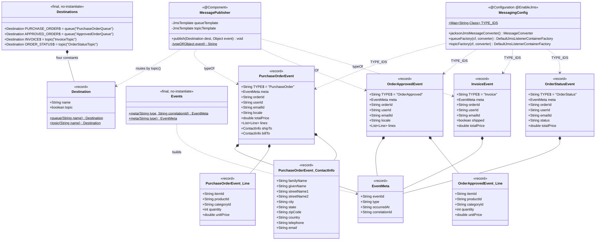
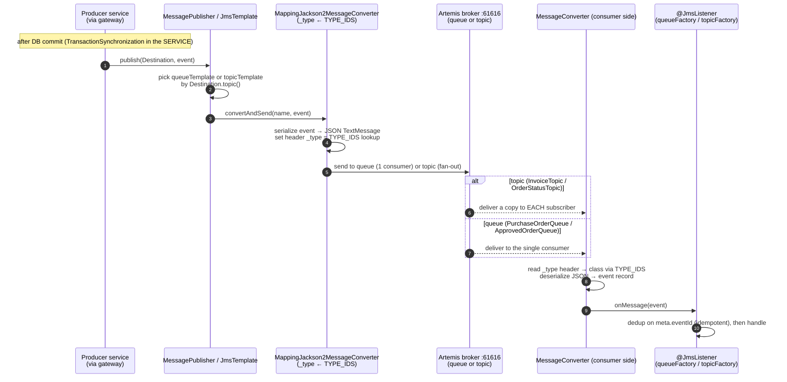

# petstore-messaging — Low-Level Design

Shared **JMS contract library** for the migrated Pet Store. No port — it is imported, not run.
It is the single source of truth for: destination names + kind, the event envelope, the four
event records, and the `_type` id → class map that keeps producers and consumers in lockstep.
Package root `com.petstore.messaging`. Shared platform conventions live in the repo skill
`../../.claude/skills/petstore-dev/SKILL.md`; architecture rationale in `../../DECISIONS.md`;
the legacy behavioural baseline in `../../docs/PARITY_AUDIT.md`.

## Overview

Three concerns, each one small type:

1. **Where** — `Destinations` holds the four destination constants, each a `Destination`
   record carrying its name and whether it is a topic (pub/sub) or a queue (point-to-point).
2. **What** — `events/` holds the four event records; every event embeds an `EventMeta`
   envelope built by the `Events` factory. Each event has a `TYPE` constant = its logical
   type = its JMS `_type` id.
3. **How** — `MessagingConfig` is the one JMS config imported by every service: the
   `TYPE_IDS` map wires `_type` → class, `jacksonJmsMessageConverter` (a
   `MappingJackson2MessageConverter`) serialises to JSON and stamps/reads `_type`, and
   `queueFactory`/`topicFactory` supply `@JmsListener` container factories. `MessagePublisher`
   is a thin `publish(dest, event)` that routes by `Destination.topic()` and stamps `_type`.

## Class design (`com.petstore.messaging`)

Notes: `Destination`, `EventMeta` and every event are plain Java `record`s (no Spring/JPA
annotations) — Jackson maps them by component name. `Destinations` and `Events` are final,
non-instantiable holders. `MessagePublisher` holds two `JmsTemplate`s because a template's
pub/sub mode is fixed at construction; `typeOf` returns null for events it does not recognise
(currently `OrderStatusEvent` is published by services via the converter's own `_type`
stamping rather than this helper — the converter always stamps from `TYPE_IDS`).

## Destinations & events

| Destination (name) | Kind | Event class (`TYPE` id) | Producer → Consumer(s) |
|--------------------|------|-------------------------|------------------------|
| `PurchaseOrderQueue` (`Destinations.PURCHASE_ORDER`) | queue (point-to-point) | `PurchaseOrderEvent` (`"PurchaseOrder"`) | storefront checkout (`petstore-app-v1`) → order-processing-service (persist + auto-approve) |
| `ApprovedOrderQueue` (`Destinations.APPROVED_ORDER`) | queue (point-to-point) | `OrderApprovedEvent` (`"OrderApproved"`) | order-processing-service (approval) → inventory-service (fulfil) |
| `InvoiceTopic` (`Destinations.INVOICE`) | topic (pub/sub) | `InvoiceEvent` (`"Invoice"`) | inventory-service (ship/invoice) → order-processing-service (mark COMPLETED) **and** notification-service (email) |
| `OrderStatusTopic` (`Destinations.ORDER_STATUS`) | topic (pub/sub) | `OrderStatusEvent` (`"OrderStatus"`) | order-processing-service (approve/deny/complete) → notification-service (status email) |

Queues carry **commands** ("do this once", one consumer); topics carry **facts** ("this
happened", fan-out to every subscriber). `InvoiceTopic`/`OrderStatusTopic` restore the legacy
Pet Store pub/sub design (`InvoiceMDB`, `MailOrderApprovalMDB`, `MailCompletedOrderMDB`).

## Envelope + `_type` id routing mechanism

Every event embeds an `EventMeta` envelope alongside its domain payload — no generic wrapper,
because Jackson cannot deserialize a generic wrapper cleanly without type hints. `EventMeta`
carries cross-cutting fields: `eventId` (unique per message — enables consumer dedup, since
JMS is at-least-once), `type` (the logical event type, equal to the JMS `_type` id),
`occurredAt` (ISO-8601 instant), and `correlationId` (carried from the request's
`X-Correlation-Id`/MDC so one trace spans HTTP → JMS). `Events.meta(...)` mints it.

Routing works through one map. `MessagingConfig.TYPE_IDS` maps each event's `TYPE` constant to
its class. That same map is handed to the `MappingJackson2MessageConverter`
(`setTypeIdMappings(TYPE_IDS)`, `setTypeIdPropertyName("_type")`). On **send**, the converter
serialises the event to a JSON `TextMessage` and writes the short `_type` id (e.g.
`"PurchaseOrder"`) into a string header. On **receive**, the converter reads the `_type`
header, looks up the target class in the same map, and deserialises to that record. Because
producers and consumers share one `TYPE_IDS` map from this one library, they can never disagree
on what a `_type` id means. `EventSerializationTest.typeIdMap_coversAllEvents` pins that the
map contains all four types.

## Sequence — generic publish → convert(`_type`) → deliver → consume

## Design decisions / invariants

- **One `MessagingConfig`, imported by all.** Replaces the per-service `JmsConfig` copies;
  eliminates destination-name and `_type`-map drift by construction. Services import it — they
  never re-declare the converter or factories (repo skill, hexagonal rule 3).
- **`TYPE_IDS` is the routing source of truth.** Adding/changing an event = edit the event
  record's `TYPE`, add it to `TYPE_IDS`, and extend `EventSerializationTest` — in one change.
- **Backward-compat nullability.** New event fields are added as nullable and never
  reordered/renamed/removed, so in-flight messages from an older producer still deserialize on
  a newer consumer across a rolling deploy. Example: `PurchaseOrderEvent.shipTo`/`billTo` and
  `ContactInfo.streetName2` are nullable by design.
- **Kind is data, not convention.** `Destination.topic()` (not a naming rule) decides pub/sub
  vs point-to-point, so `MessagePublisher` and the listener factories route correctly and a
  caller cannot accidentally send a queue command over a topic.
- **Transport-only.** After-commit publishing lives in the *services'* gateways
  (`TransactionSynchronization`), not here; this library just sends. Consumers own idempotency
  (dedup on `EventMeta.eventId`).
- **Library, not service.** No port, no `@SpringBootApplication`; `mvn install` to `~/.m2`,
  and every dependent must be rebuilt when the contract changes.

## See also

- Future-Claude guide: `../CLAUDE.md`
- Per-module conventions skill: `../.claude/skills/petstore-messaging/SKILL.md`
- Repo skill (JMS contract section): `../../.claude/skills/petstore-dev/SKILL.md`
- Parity baseline: `../../docs/PARITY_AUDIT.md` — Architecture rationale / ADRs: `../../DECISIONS.md`
