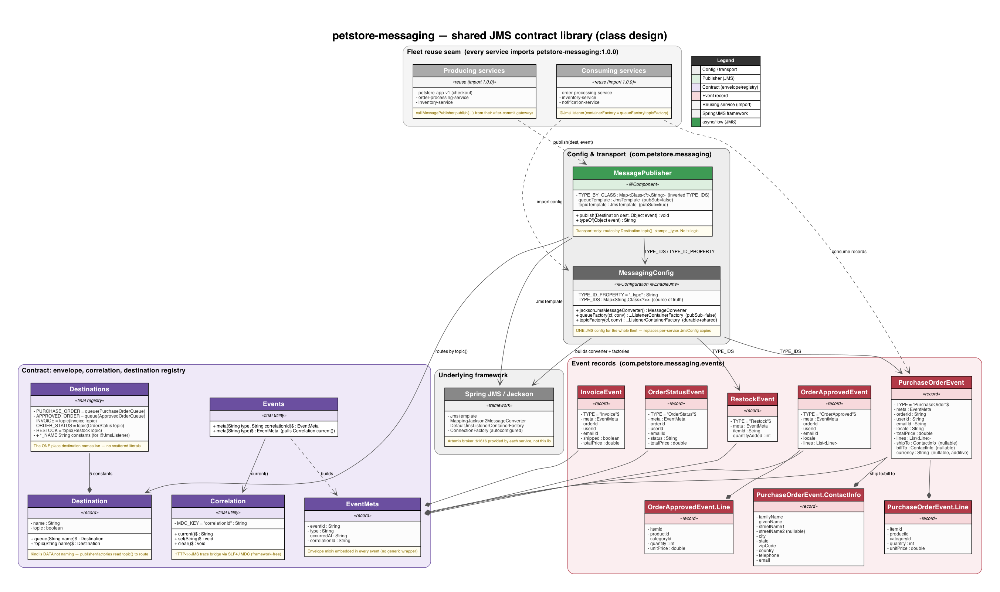
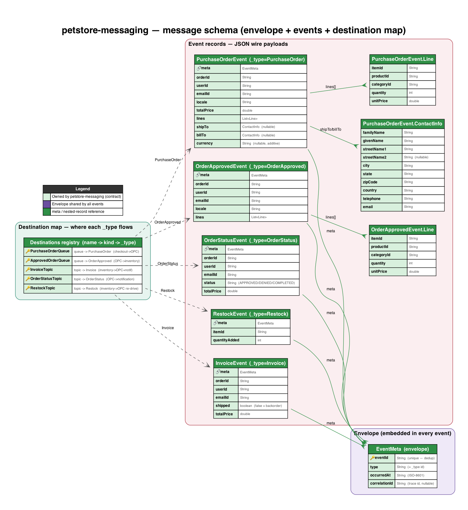
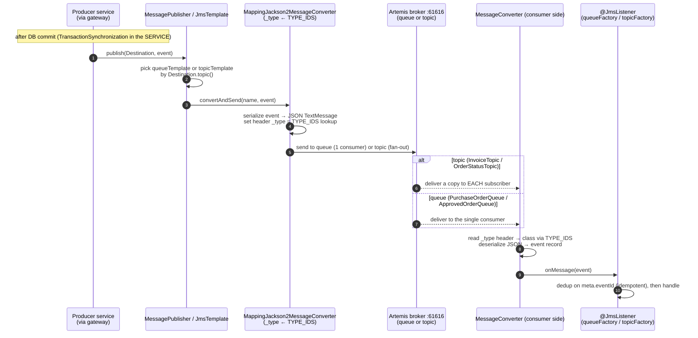

# petstore-messaging — Low-Level Design

Shared **JMS contract library** for the migrated Pet Store. No port — it is imported, not run.
It is the single source of truth for: destination names + kind, the event envelope, the five
event records, and the `_type` id → class map that keeps producers and consumers in lockstep.
Package root `com.petstore.messaging`. Shared platform conventions live in the repo skill
`../../.claude/skills/petstore-dev/SKILL.md`; architecture rationale in `../../DECISIONS.md`;
the legacy behavioural baseline in `../../docs/PARITY_AUDIT.md`.

## Class & schema diagrams

Generated by `petstore-messaging_lld.py` (imports the shared house style in `../../docs/lld_style.py`).
Regenerate with `cd docs && python3 petstore-messaging_lld.py`.

-  — [petstore-messaging_class.png](petstore-messaging_class.png) · [svg](petstore-messaging_class.svg)
  UML class diagram: the config/transport layer (`MessagingConfig` + `MessagePublisher`),
  the contract layer (`EventMeta`, `Events`, `Correlation`, `Destination`, `Destinations`), the
  five event records with their nested records, and the **fleet reuse seam** — every service
  importing `petstore-messaging:1.0.0` to publish or `@JmsListener`-consume.
-  — [petstore-messaging_schema.png](petstore-messaging_schema.png) · [svg](petstore-messaging_schema.svg)
  Message-schema / data-model (this library has **no database**): the `EventMeta` envelope
  embedded in every event, each event record's JSON wire fields (PK = the dedup `eventId`,
  nullable/additive fields flagged), and the `Destinations` registry mapping every
  destination name → kind (queue/topic) → `_type` id → producer/consumer route.

## Overview

Three concerns, each one small type:

1. **Where** — `Destinations` holds the five destination constants (2 queues + 3 topics), each a
   `Destination` record carrying its name and whether it is a topic (pub/sub) or a queue (point-to-point).
2. **What** — `events/` holds the five event records; every event embeds an `EventMeta`
   envelope built by the `Events` factory. Each event has a `TYPE` constant = its logical
   type = its JMS `_type` id.
3. **How** — `MessagingConfig` is the one JMS config imported by every service: the
   `TYPE_IDS` map wires `_type` → class, `jacksonJmsMessageConverter` (a
   `MappingJackson2MessageConverter`) serialises to JSON and stamps/reads `_type`, and
   `queueFactory`/`topicFactory` supply `@JmsListener` container factories. `MessagePublisher`
   is a thin `publish(dest, event)` that routes by `Destination.topic()` and stamps `_type`.

## Class design (`com.petstore.messaging`)

```mermaid
classDiagram
    class Destination {
        <<record>>
        +String name
        +boolean topic
        +queue(String name)$ Destination
        +topic(String name)$ Destination
    }

    class Destinations {
        <<final, no-instantiate>>
        +Destination PURCHASE_ORDER$ = queue("PurchaseOrderQueue")
        +Destination APPROVED_ORDER$ = queue("ApprovedOrderQueue")
        +Destination INVOICE$ = topic("InvoiceTopic")
        +Destination ORDER_STATUS$ = topic("OrderStatusTopic")
    }

    class EventMeta {
        <<record>>
        +String eventId
        +String type
        +String occurredAt
        +String correlationId
    }

    class Events {
        <<final, no-instantiate>>
        +meta(String type, String correlationId)$ EventMeta
        +meta(String type)$ EventMeta
    }

    class MessagingConfig {
        <<@Configuration @EnableJms>>
        +Map~String,Class~ TYPE_IDS$
        +jacksonJmsMessageConverter() MessageConverter
        +queueFactory(cf, converter) DefaultJmsListenerContainerFactory
        +topicFactory(cf, converter) DefaultJmsListenerContainerFactory
    }

    class MessagePublisher {
        <<@Component>>
        -JmsTemplate queueTemplate
        -JmsTemplate topicTemplate
        +publish(Destination dest, Object event) void
        -typeOf(Object event)$ String
    }

    class PurchaseOrderEvent {
        <<record>>
        +String TYPE$ = "PurchaseOrder"
        +EventMeta meta
        +String orderId
        +String userId
        +String emailId
        +String locale
        +double totalPrice
        +List~Line~ lines
        +ContactInfo shipTo
        +ContactInfo billTo
    }
    class PurchaseOrderEvent_Line {
        <<record>>
        +String itemId
        +String productId
        +String categoryId
        +int quantity
        +double unitPrice
    }
    class PurchaseOrderEvent_ContactInfo {
        <<record>>
        +String familyName
        +String givenName
        +String streetName1
        +String streetName2
        +String city
        +String state
        +String zipCode
        +String country
        +String telephone
        +String email
    }

    class OrderApprovedEvent {
        <<record>>
        +String TYPE$ = "OrderApproved"
        +EventMeta meta
        +String orderId
        +String userId
        +String emailId
        +String locale
        +List~Line~ lines
    }
    class OrderApprovedEvent_Line {
        <<record>>
        +String itemId
        +String productId
        +String categoryId
        +int quantity
        +double unitPrice
    }

    class InvoiceEvent {
        <<record>>
        +String TYPE$ = "Invoice"
        +EventMeta meta
        +String orderId
        +String userId
        +String emailId
        +boolean shipped
        +double totalPrice
    }

    class OrderStatusEvent {
        <<record>>
        +String TYPE$ = "OrderStatus"
        +EventMeta meta
        +String orderId
        +String userId
        +String emailId
        +String status
        +double totalPrice
    }

    class RestockEvent {
        <<record>>
        +String TYPE$ = "Restock"
        +EventMeta meta
        +String itemId
        +int quantityAdded
    }

    Destinations *-- Destination : five constants
    Events ..> EventMeta : builds
    MessagePublisher ..> Destination : routes by topic()
    MessagePublisher ..> PurchaseOrderEvent : typeOf
    MessagePublisher ..> OrderApprovedEvent : typeOf
    MessagePublisher ..> InvoiceEvent : typeOf
    MessagingConfig ..> PurchaseOrderEvent : TYPE_IDS
    MessagingConfig ..> OrderApprovedEvent : TYPE_IDS
    MessagingConfig ..> InvoiceEvent : TYPE_IDS
    MessagingConfig ..> OrderStatusEvent : TYPE_IDS
    MessagingConfig ..> RestockEvent : TYPE_IDS
    PurchaseOrderEvent *-- EventMeta
    PurchaseOrderEvent *-- PurchaseOrderEvent_Line
    PurchaseOrderEvent *-- PurchaseOrderEvent_ContactInfo
    OrderApprovedEvent *-- EventMeta
    OrderApprovedEvent *-- OrderApprovedEvent_Line
    InvoiceEvent *-- EventMeta
    OrderStatusEvent *-- EventMeta
    RestockEvent *-- EventMeta
```

Notes: `Destination`, `EventMeta` and every event are plain Java `record`s (no Spring/JPA
annotations) — Jackson maps them by component name. `Destinations` and `Events` are final,
non-instantiable holders. `MessagePublisher` holds two `JmsTemplate`s because a template's
pub/sub mode is fixed at construction; `typeOf` returns null for events it does not recognise
(currently `OrderStatusEvent` is published by services via the converter's own `_type`
stamping rather than this helper — the converter always stamps from `TYPE_IDS`).

## Destinations & events

| Destination (name) | Kind | Event class (`TYPE` id) | Producer → Consumer(s) |
|--------------------|------|-------------------------|------------------------|
| `PurchaseOrderQueue` (`Destinations.PURCHASE_ORDER`) | queue (point-to-point) | `PurchaseOrderEvent` (`"PurchaseOrder"`) | **alt** async intake → order-processing-service (persist + auto-approve). The live storefront checkout uses synchronous REST intake (`POST /api/orders/intake`) instead; OPC's `OrderListener` still consumes this queue |
| `ApprovedOrderQueue` (`Destinations.APPROVED_ORDER`) | queue (point-to-point) | `OrderApprovedEvent` (`"OrderApproved"`) | order-processing-service (approval) → inventory-service (fulfil) |
| `InvoiceTopic` (`Destinations.INVOICE`) | topic (pub/sub) | `InvoiceEvent` (`"Invoice"`) | inventory-service (ship/invoice) → order-processing-service (mark COMPLETED) **and** notification-service (email) |
| `OrderStatusTopic` (`Destinations.ORDER_STATUS`) | topic (pub/sub) | `OrderStatusEvent` (`"OrderStatus"`) | order-processing-service (approve/deny/complete) → notification-service (status email) |
| `RestockTopic` (`Destinations.RESTOCK`) | topic (pub/sub) | `RestockEvent` (`"Restock"`) | inventory-service (restock) → order-processing-service (re-drive APPROVED backorders, retry-on-restock H2) |

Queues carry **commands** ("do this once", one consumer); topics carry **facts** ("this
happened", fan-out to every subscriber). `InvoiceTopic`/`OrderStatusTopic` restore the legacy
Pet Store pub/sub design (`InvoiceMDB`, `MailOrderApprovalMDB`, `MailCompletedOrderMDB`).

## Envelope + `_type` id routing mechanism

Every event embeds an `EventMeta` envelope alongside its domain payload — no generic wrapper,
because Jackson cannot deserialize a generic wrapper cleanly without type hints. `EventMeta`
carries cross-cutting fields: `eventId` (unique per message — enables consumer dedup, since
JMS is at-least-once), `type` (the logical event type, equal to the JMS `_type` id),
`occurredAt` (ISO-8601 instant), and `correlationId` (carried from the request's
`X-Correlation-Id`/MDC so one trace spans HTTP → JMS). `Events.meta(...)` mints it.

Routing works through one map. `MessagingConfig.TYPE_IDS` maps each event's `TYPE` constant to
its class. That same map is handed to the `MappingJackson2MessageConverter`
(`setTypeIdMappings(TYPE_IDS)`, `setTypeIdPropertyName("_type")`). On **send**, the converter
serialises the event to a JSON `TextMessage` and writes the short `_type` id (e.g.
`"PurchaseOrder"`) into a string header. On **receive**, the converter reads the `_type`
header, looks up the target class in the same map, and deserialises to that record. Because
producers and consumers share one `TYPE_IDS` map from this one library, they can never disagree
on what a `_type` id means. `EventSerializationTest.typeIdMap_coversAllEvents` pins that the
map contains all five types.

## Sequence — generic publish → convert(`_type`) → deliver → consume

## Design decisions / invariants

- **One `MessagingConfig`, imported by all.** Replaces the per-service `JmsConfig` copies;
  eliminates destination-name and `_type`-map drift by construction. Services import it — they
  never re-declare the converter or factories (repo skill, hexagonal rule 3).
- **`TYPE_IDS` is the routing source of truth.** Adding/changing an event = edit the event
  record's `TYPE`, add it to `TYPE_IDS`, and extend `EventSerializationTest` — in one change.
- **Backward-compat nullability.** New event fields are added as nullable and never
  reordered/renamed/removed, so in-flight messages from an older producer still deserialize on
  a newer consumer across a rolling deploy. Example: `PurchaseOrderEvent.shipTo`/`billTo` and
  `ContactInfo.streetName2` are nullable by design.
- **Kind is data, not convention.** `Destination.topic()` (not a naming rule) decides pub/sub
  vs point-to-point, so `MessagePublisher` and the listener factories route correctly and a
  caller cannot accidentally send a queue command over a topic.
- **Transport-only.** After-commit publishing lives in the *services'* gateways
  (`TransactionSynchronization`), not here; this library just sends. Consumers own idempotency
  (dedup on `EventMeta.eventId`).
- **Library, not service.** No port, no `@SpringBootApplication`; `mvn install` to `~/.m2`,
  and every dependent must be rebuilt when the contract changes.

## Reusability & extensibility

This module *is* the reusability seam of the fleet — its whole reason to exist is to be reused
rather than copy-pasted. Concretely:

**What is reused (and by whom)**

- **The whole library, as `petstore-messaging:1.0.0`.** Every one of the 8 services imports it
  from `~/.m2`; nothing here is per-service. `build-all.sh` `mvn install`s it first for that reason.
- **`MessagingConfig` — one JMS config for all.** Services import it (component scan / `@Import`)
  to get `jacksonJmsMessageConverter`, `queueFactory` (pub/sub off) and `topicFactory` (pub/sub on,
  durable + shared). It replaces the per-service `JmsConfig` copies that used to drift.
- **`MessagePublisher` (`@Component`) — one transport.** Producers (`petstore-app-v1` checkout,
  `order-processing-service`, `inventory-service`) call `publish(Destination, event)`; nobody
  touches `JmsTemplate`, the pub/sub flag or the `_type` header themselves.
- **`Destinations` — the one name registry.** Both producers and `@JmsListener` consumers
  reference `Destinations.*` / `Destinations.*_NAME`, so a listener and its `Destination` can
  never drift apart.
- **`EventMeta` + `Events` + `Correlation` — a shared envelope & trace bridge.** Every event
  embeds the same `EventMeta`; `Correlation` (framework-free, slf4j-only) carries one
  `correlationId` across the HTTP↔JMS boundary so a checkout traces end-to-end. Because these are
  plain records, callers reuse them as ordinary DTOs.
- **`TYPE_IDS` — one routing map.** Shared by both the converter (inbound `_type` → class) and
  `MessagePublisher.TYPE_BY_CLASS` (outbound class → `_type`, derived by inverting the same map),
  so producers and consumers can never disagree on what a `_type` id means.

**How it is extended safely (concrete seams)**

- **A new event type.** Add a record under `events/` with a `public static final String TYPE`,
  add one line to `MessagingConfig.TYPE_IDS`, and extend `EventSerializationTest`. Both the
  converter and `MessagePublisher.TYPE_BY_CLASS` pick it up from that single map — no parallel
  `instanceof` chain to update.
- **A new destination.** Add a constant to `Destinations` via `Destination.queue(...)` or
  `Destination.topic(...)` (kind is *data*, not a naming convention). The publisher and the
  listener factories route by `Destination.topic()`, so the right transport is chosen for free;
  add a `*_NAME` String constant so `@JmsListener` can reference it.
- **A new field on an existing event.** Add it **nullable and last** (never reorder/rename/remove):
  `PurchaseOrderEvent.shipTo`/`billTo`/`currency` and `ContactInfo.streetName2` are the pattern.
  `FAIL_ON_UNKNOWN_PROPERTIES=false` in the converter makes both directions safe across an
  in-flight rolling deploy (older producer → newer consumer and vice-versa).
- **A new subscriber to an existing topic.** Attach a `@JmsListener(containerFactory =
  "topicFactory")` with a **distinct** `subscription` name (durable + shared, JMS 2.0). Because
  topics fan out, the producer is untouched — e.g. `RestockTopic` and `InvoiceTopic` already fan
  to multiple services, and analytics/alerting could subscribe next with zero producer changes.
- **What must NOT leak in.** No business logic and no transactional coupling: after-commit
  publishing stays in each service's gateway (`TransactionSynchronization`); consumer idempotency
  (dedup on `EventMeta.eventId`) stays in consumers. This library is intentionally transport +
  contract only.

## See also

- Future-Claude guide: `../CLAUDE.md`
- Per-module conventions skill: `../.claude/skills/petstore-messaging/SKILL.md`
- Repo skill (JMS contract section): `../../.claude/skills/petstore-dev/SKILL.md`
- Parity baseline: `../../docs/PARITY_AUDIT.md` — Architecture rationale / ADRs: `../../DECISIONS.md`
